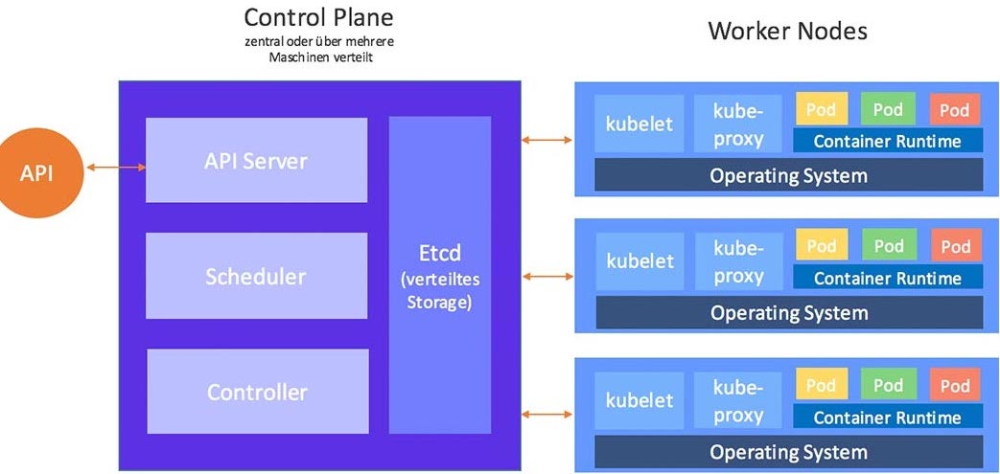

# 1. Kubernetes Basicsおさらい

# 1.1 マスター・ワーカーアーキテクチャ

マスターノード (またはControl Plane): 
- K8sクラスターの頭脳
- 冗長化・Security・Storage・スケーリングなど

ワーカーノード: 
- マスターノードの命令に従ってコンテナを起動・削除
- Metricsをマスターノードに送る
- コンテナのRuntimeがある

# 1.2 マスターノード (Control Plane)

- API server: kubectl CLIからのAPIリクエストを承認して、APIを実行
- Etcd: key-value を保存
- Controller: PodやDeploymentのヘルスチェックなどを行い、保持
- Scheduler: 新Podを作成し、Nodeに割り当てる

# 1.3 ワーカーノード (Data Plane)

- Kubelet: ワーカーノードに起動されているエージェントプロセス。マスターノードと接続し命令を実行
- Container runtime: DockerのRuntime
- Kubectl: CLI

# 1.4 K8s オブジェクト - pod, deployment, service, configmap, serviceaccount, ingress, etc

Pod

Deployment

Service

Ingress

ConfigMap
