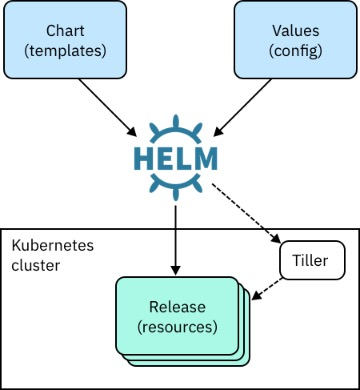

# 3. Helm Chart のおさらい

## Helm v3をインストール 
Ref: https://helm.sh/docs/intro/install/
```bash
# install brew package manageer
# ref: https://docs.brew.sh/Installation
mkdir homebrew && curl -L https://github.com/Homebrew/brew/tarball/master | tar xz --strip 1 -C homebrew

# install helm via brew
brew install helm

# Windows
# install chocolate package manager first
https://chocolatey.org/docs/installation

# install helm with choco
choco install kubernetes-helm

helm version
```

## Helm の概要


- KubernetesのYAMLリソース(pod, deployment, service)から変数を除外し、 `values.yaml`で一括管理
- 複数のKubernetesのYAMLリソース(pod, deployment, service)をバンドル化して、1つのArtifactであるChartとして管理into a single wrapper object called helm chart

## Helm Chartフォルダーのアナトミー
```bash
$ tree

.
├── Chart.yaml
├── charts
├── templates
│   ├── NOTES.txt
│   ├── _helpers.tpl
│   ├── deployment.yaml
│   ├── hpa.yaml
│   ├── ingress.yaml
│   ├── service.yaml
│   ├── serviceaccount.yaml
│   └── tests
│       └── test-connection.yaml
└── values.yaml
```

トップレベルにある `Chart.yaml` にチャートのメタデータが入ってます
```yaml
apiVersion: v2

# Helm Chart の名前
name: my-nginx
description: A Helm chart for Kubernetes

type: application

# Helm Chart のバージョン
version: 0.1.0

# Nginx のバージョン
appVersion: 1.16.0
```

トップレベルにある  `values.yaml` に変数を定義します
```yaml
replicaCount: 1

image:
  repository: nginx
  pullPolicy: IfNotPresent
  # Overrides the image tag whose default is the chart appVersion.
  tag: ""

service:
  type: ClusterIP
  port: 80

ingress:
  enabled: false
  annotations: {}
    # kubernetes.io/ingress.class: nginx
    # kubernetes.io/tls-acme: "true"
  hosts:
    - host: chart-example.local
      paths: []
  tls: []
  #  - secretName: chart-example-tls
  #    hosts:
  #      - chart-example.local

autoscaling:
  enabled: false
  minReplicas: 1
  maxReplicas: 100
  targetCPUUtilizationPercentage: 80
  # targetMemoryUtilizationPercentage: 80
```

`/templates`にK8sのYAMLがあります
```
├── templates
│   ├── NOTES.txt
│   ├── _helpers.tpl
│   ├── deployment.yaml
│   ├── hpa.yaml
│   ├── ingress.yaml
│   ├── service.yaml
│   ├── serviceaccount.yaml
```

## Helm コマンドの流れ
まずは Helm リポを追加
```bash
# deprecated
# helm repo add stable https://kubernetes-charts.storage.googleapis.com/

# new chart link
https://charts.helm.sh/stable
```

Helm リポ内でチャートを検索
```bash
helm search repo stable

# このNginxはingress controller用
helm search repo nginx

# スタンドアローンのNginxは bitnami のリポにあります
helm repo add bitnami https://charts.bitnami.com/bitnami
helm repo update

#　search again
helm search repo nginx

# now bitnami/nginx shows up
helm search repo bitnami/nginx
```

インストール
```bash
# 例: helm install RELEASE_NAME REPO_NAME
helm install nginx bitnami/nginx
```

アップグレード
```bash
# upgrade after changing values in yaml
helm upgrade nginx bitnami/nginx --dry-run

# upgrade using values in overrides.yaml
helm upgrade nignx bitnami/nginx -f overrides.yaml

# ロールバック
helm rollback nginx REVISION_NUMBER
```

他のコマンド
```bash
helm list 
helm status nginx
helm history nginx

# インストールされたチャートからYAMLを取得
helm get manifest nginx
helm get values nginx

helm uninstall nginx
```