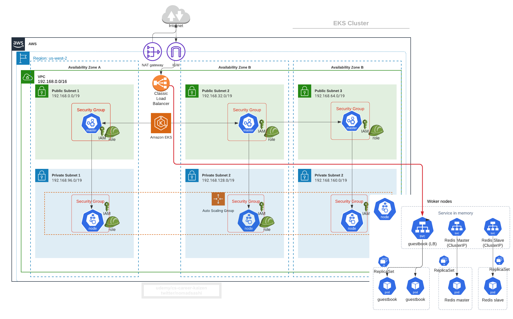

# 5. サンプルアプリをEKSクラスターにディプロイ

Refs: 
- https://github.com/kubernetes/examples/blob/master/guestbook-go/README.md


フロントエンドはPHP app
- PublicのAWSロードバランサー
- DBのReadリクエストは複数のSlave　Podsに負荷分散
- DBのWriteリクエストはMaster Podへ

バックエンドのRedis
- 1つのマスターPod (write)
- 複数のスレーブPods (read)

# 5.1 RedisのMaster Podとサービスをディプロイ
```
kubectl apply -f https://raw.githubusercontent.com/kubernetes/examples/master/guestbook-go/redis-master-controller.json

kubectl apply -f https://raw.githubusercontent.com/kubernetes/examples/master/guestbook-go/redis-master-service.json
```

# 5.2 RedisのSlave Podsとサービスをディプロイ
```
kubectl apply -f https://raw.githubusercontent.com/kubernetes/examples/master/guestbook-go/redis-slave-controller.json

kubectl apply -f https://raw.githubusercontent.com/kubernetes/examples/master/guestbook-go/redis-slave-service.json
```

# 5.3 フロントエンドアプリをディプロイ
```
kubectl apply -f https://raw.githubusercontent.com/kubernetes/examples/master/guestbook-go/guestbook-controller.json

kubectl apply -f https://raw.githubusercontent.com/kubernetes/examples/master/guestbook-go/guestbook-service.json
```

`replicationcontroller`を表示
```
kubectl get replicationcontroller
```

アウトプット
```
NAME           DESIRED   CURRENT   READY   AGE
guestbook      3         3         3       15m
redis-master   1         1         1       16m
redis-slave    2         2         2       15m
```

ServiceとPodを表示
```
kubectl get pod,service
```

アウトプット
```
NAME                     READY   STATUS    RESTARTS   AGE
pod/guestbook-dxkpd      1/1     Running   0          16m
pod/guestbook-fsqx8      1/1     Running   0          16m
pod/guestbook-nnrjc      1/1     Running   0          16m
pod/redis-master-6dbj4   1/1     Running   0          17m
pod/redis-slave-c6wtv    1/1     Running   0          16m
pod/redis-slave-qccp6    1/1     Running   0          16m

NAME                   TYPE           CLUSTER-IP      EXTERN
AL-IP
       PORT(S)          AGE
service/guestbook      LoadBalancer   10.100.36.45    a24ac7
1d1c2e046f59e46720494f5322-359345983.us-west-2.elb.amazonaws
.com   3000:30604/TCP   15m
service/kubernetes     ClusterIP      10.100.0.1      <none>

       443/TCP          158m
service/redis-master   ClusterIP      10.100.174.46   <none>

       6379/TCP         17m
service/redis-slave    ClusterIP      10.100.103.40   <none>

       6379/TCP         16m
```

# 5.4 外部に公開するELBのDNSを取得
```
$ echo $(kubectl  get svc guestbook | awk '{ print $4 }' | tail -1):$(kubectl  get svc guestbook | awk '{ print $5 }' | tail -1 | cut -d ":" -f 1
3000)

a24ac71d1c2e046f59e46720494f5322-359345983.us-west-2.elb.amazonaws.com:3000
```

３ー5分待った後にブラウザーからアクセス


# 5.5 図解でおさらい



#### もし全てのリソースをアンインストールしたい場合
__注意:__　次のChapterでPodをIngressを使って外部公開するので、まだアンインストールしないでください。
下記はあくまで参照まででです。
```sh
kubectl delete pods,svc,deploy,replicaset --all

# もしくわ
kubectl delete -f examples/guestbook-go
```