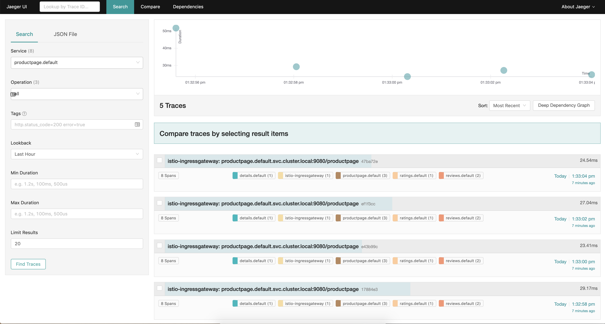

# 10. Observability/モニタリング

# 10.1 Istio Envoy Proxyのログをチェック

profile `demo`では、ログは有効化されています。
```sh
meshConfig:
    accessLogFile: /dev/stdout
```

まず`/productpage`にIngress Gatewayを通してアクセスしてみる
```sh
for i in {1..5}; do curl $(echo $(kubectl -n istio-system get service istio-ingressgateway -o jsonpath='{.status.loadBalancer.ingress[0].hostname}')/productpage) -L -k; done
```

istio sidecar proxyコンテナのログを`-c istio-proxy`で取得 
```sh
kubectl logs $(kubectl get pod -l app=productpage -o jsonpath='{.items[0].metadata.name}') -c istio-proxy | tail

# アウトプット
[2020-08-09T06:33:04.054Z] "GET /productpage HTTP/1.1" 200 - "-" "-" 0 5179 21 21 "192.168.34.210" "curl/7.54.0" "b00a9a1f-8f01-9b76-b47f-ca8515f15098" "a5a1acc36239d46038f3dd828465c946-706040707.us-west-2.elb.amazonaws.com" "127.0.0.1:9080" inbound|9080|http|productpage.default.svc.cluster.local 127.0.0.1:58640 192.168.44.36:9080 192.168.34.210:0 outbound_.9080_._.productpage.default.svc.cluster.local default # <----- inbound to productpage: "inbound|9080|http|productpage.default.svc.cluster.local"

[2020-08-09T06:33:04.064Z] "GET /reviews/0 HTTP/1.1" 200 - "-" "-" 0 375 8 8 "-" "curl/7.54.0" "b00a9a1f-8f01-9b76-b47f-ca8515f15098" "reviews:9080" "192.168.65.133:9080" outbound|9080|v3|reviews.default.svc.cluster.local 192.168.44.36:53640 10.100.5.108:9080 192.168.44.36:37054 - - # <----- outbound from productpage to reviews: "outbound|9080|v3|reviews.default.svc.cluster.local"
```

# 10.2 Jaeger でリクエストTracingのダッシュボードをチェック
Ref: https://istio.io/latest/docs/tasks/observability/distributed-tracing/jaeger/#generating-traces-using-the-bookinfo-sample

`Jaeger` はすでに`demo`のprofileでインストールされています。

Jaegerのdashboardをチェック
```
istioctl dashboard jaeger
```



`/productpage`へのリクエストをクリック


> The trace is comprised of a set of spans, where each span corresponds to a Bookinfo service, invoked during the execution of a /productpage request, or internal Istio component, for example: istio-ingressgateway.


# 10.3 KialiでService MeshをVisualize
Kialiのdashboardをチェック
```sh
istioctl dashboard kiali
```

Usernameとpasswordはデフォルトで`admin`です。


