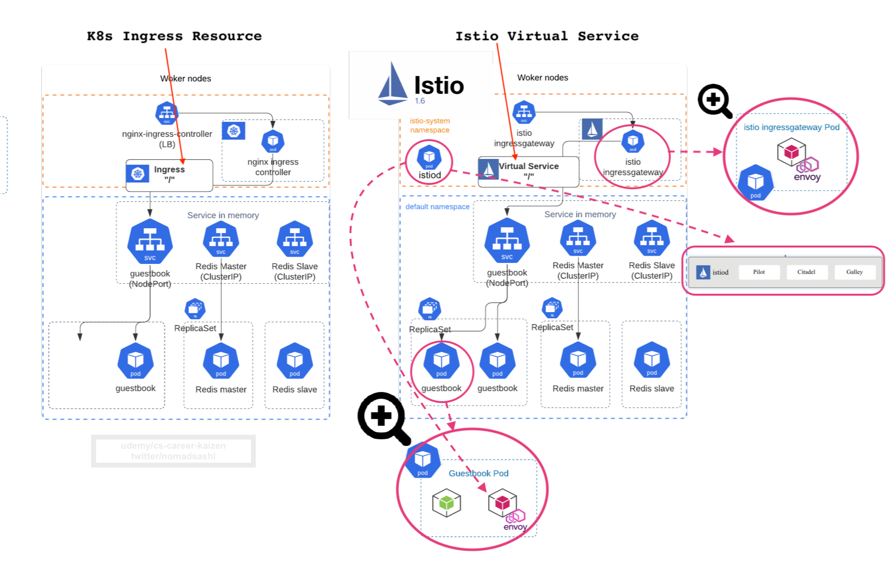
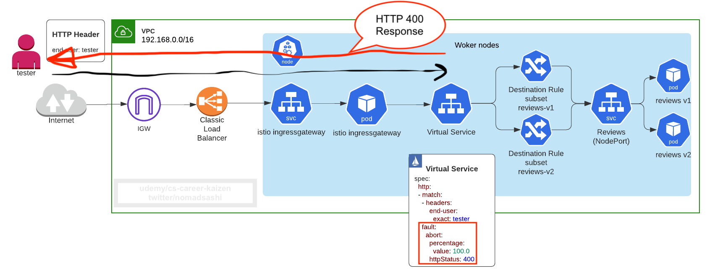
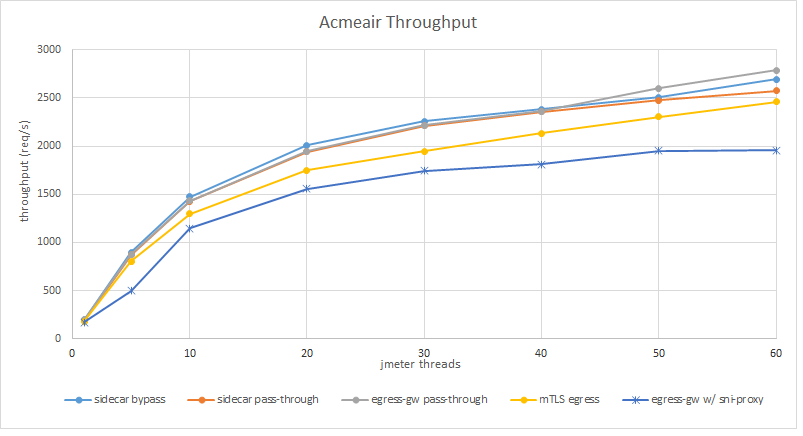

# 1. イントロダクション

# 1.1 Service Meshって何？
Ref: https://istio.io/docs/concepts/what-is-istio/#what-is-a-service-mesh


__Istio Service Mesh__ はKubernetesクラスター内に __Envoy proxy__ コンテナによって形成された網や蜘蛛の巣(例： __mesh__)のようなものです。


それぞれのPodが点とした場合に、5個のPod同士が接続するPermutationsは5!、もしくは5x4x3x2x1= __120__ ものパターンあります。この複雑な接続を管理するために、Service Meshが使われます。


Istio Service Meshでは __Envoy proxy__ コンテナがアプリのPod内にSidecarとしてInjectされます。


またIstioの利点としては、デフォルトでクラスター内のPod間の接続が __mutual TLS__　な点です。

例えば、istioなしの場合, __Ingress controller__　を使って __TLS termnation__ をすることは既に知っているかと思います


__istio__ ありの場合、 アプリのコードを変更せずに __Pod間の接続を__ __mutual TLS__ にアップグレードできます


# 1.2 Istio Service Mesh アーキテクチャ
Ref: https://istio.io/latest/docs/ops/deployment/architecture/


簡単なアーキテクチャダイアグラム:


IstioのControl PlaneとData Planeの関係性：


- Istio Service Meshは __control plane__(istiod) と __data plane__(スタンドアローンの edge Envoy proxy と sidecar Envoy proxies)で成り立ちます
- __data plane__ はプロキシ (__Envoy__)がsidecarsコンテナとしてDeployされます。 このproxiesがネットワークコネクションをInterceptしたり、コントロールします。また、MetricsもCollectします。
- __control plane__ は、YAMLの設定をData Planeに反映させたり、Administrateする役割があります。


# 1.3 v1.5の前後で変わったIstioアーキテクチャ
_Istio v1.5前_


_Istio v1.5後_

インストール・設定の複雑性を軽減し、__Pilot, Citadel, Galley, and the sidecar injector__ といったControl　Planeのコンポーネントを1つの __Istiod__ に合算させた。


# 1.4 なぜIstioを使うべきなのか？メリットとは
Ref: https://istio.io/blog/2020/tradewinds-2020/


メリット:
- [Traffic Management](https://istio.io/docs/concepts/traffic-management/)
    - Ingress Traffic を Gateway, VirtualService, DestinationRulesを使ってコントロールできる
       
    - ロードバランシング 
      
    - TLS termination
      
    - カナリーロールアウト
      
    - HTTP Headerによるrouting
          
    - delay, abort, retries, timeout
      
      
      
      
    - 本番trafficをコピー
      
    - rate limiting
    - circuit breaker
    - Egress trafficをコントロール
- [Security](https://istio.io/docs/concepts/security/)
    - デフォルトでクラスター内のPod間の接続をMutual TLS ([Auto mutual TLS among backend services](https://istio.io/docs/tasks/security/authentication/authn-policy/#auto-mutual-tls), [which doubels the latency at max or max 10ms](https://github.com/istio/tools/tree/3ac7ab40db8a0d595b71f47b8ba246763ecd6213/perf/benchmark#run-performance-tests), [also explained in Istio best practice blog](https://istio.io/blog/2019/performance-best-practices/#3-measure-with-and-without-proxies))
      
      
    - JWTによる認証と認可
      
    - 
- [Observability](Observability)
    - 自動でPod間のmetrics, logs, and tracesをAggregate
      
- istio 1.5と1.6のFeature
    - Mutual TLSのOverheadを最小限にした高パフォーマンス ([Istio Performance Benchmarking and script](https://github.com/istio/tools/tree/3ac7ab40db8a0d595b71f47b8ba246763ecd6213/perf/benchmark#run-performance-tests), [egress gateway performance testing](https://istio.io/blog/2019/egress-performance/))
        - 
        - 

Refs:
- [Istio with Kubernetes on AWS](https://github.com/aws-samples/istio-on-amazon-eks)
- [Kiali: Istio dashboard](https://kiali.io/)
- [Istio sidecar injection failing with error - MountVolume.SetUp failed for volume "istiod-ca-cert" : configmap "istio-ca-root-cert" not found #22463](https://github.com/istio/istio/issues/22463)
- [Failed to get secret "istio-ca-secret" thus istiod pod's readiness probe fails on EKS #24009](https://github.com/istio/istio/issues/24009)


# 1.5 Prerequisites

## 注釈: もしローカルでMinikubeを使ってKubernetesクラスターを使う場合は, AWS accountの作成, AWS CLIやeksctl CLIのインストールはスキップしてください


## 1.5.1 AWS IAM userとaccess keyをコンソールから作成

まずはAWS アカウントの作成
```
https://aws.amazon.com/jp/resources/create-account/?nc1=h_ls
```

## 1.5.2　AWS CLIをインストール
Ref: https://docs.aws.amazon.com/ja_jp/cli/latest/userguide/install-cliv2.html
```bash
/bin/bash -c "$(curl -fsSL https://raw.githubusercontent.com/Homebrew/install/master/install.sh)"

# Mac
brew install awscli

# Windows: https://docs.aws.amazon.com/cli/latest/userguide/install-cliv2-windows.html

aws --version

# "default" profileを作成
# aws configure

# "eks-demo" profileを作成（推奨）
aws configure --profile eks-demo


aws sts get-caller-identity
```

## 名前付きAWS Profileの作成について
本番運用なのでは、複数の名前付きProfileを扱うことになるので、`aws configure`で生成された`default`ではなく`eks-demo`などの名前付きAWS Profileを使う方が違うProfileに変更するのが楽になります。

名前付きのeks-demo`などのAWS Profileの作成方法は2つあります

1. `aws configure --profile eks-demo`(すでに上記で作成済み)
2. `~/.aws/credentials` にProfileを作成


もし`~/.aws/credentials` に新しいProfileを作成する場合は、下記を参照してください。
```
vim ~/.aws/credentials
```

`iキー`をエンターして下記のラインをコピーペーストします
```
[eks-demo] 
aws_access_key_id=xxxxx # <-----AWS ConsoleからAccess keyをペースト
aws_secret_access_key=xxxxxxx # <-----AWS ConsoleからSecret Access keyをペースト
aws_region = YOUR_REGION # <----自身のRegion
```

`escapeキー`をエンターして、 `:wq!` で保存してVIMエディターからExitします


その後
```sh
export AWS_PROFILE=esk-demo

# output
aws sts get-caller-identity
{
    "UserId": "xxxxxxxxx",
    "Account": "12321313123131",
    "Arn": "arn:aws:iam::1231231231231:user/eks-demo"
}
```
と返ってきたらAWSへの認証が取れたことが確認できました。


## 1.5.3  aws-iam-authenticatorをインストール
Ref: https://docs.aws.amazon.com/eks/latest/userguide/install-aws-iam-authenticator.html
```bash
# Mac
brew install aws-iam-authenticator

# Windows
# install chocolatey first: https://chocolatey.org/install
choco install -y aws-iam-authenticator
```

## 1.5.4 kubectlをインストール
Ref: https://kubernetes.io/docs/tasks/tools/install-kubectl/
```bash
# Mac
brew install kubectl 

# Windows
choco install kubernetes-cli

kubectl version
```

## 1.5.5 eksctlをインストール
Ref: https://docs.aws.amazon.com/eks/latest/userguide/getting-started-eksctl.html
```bash
# Mac
brew tap weaveworks/tap
brew install weaveworks/tap/eksctl

# Windows: https://docs.aws.amazon.com/eks/latest/userguide/eksctl.html
# install eskctl from chocolatey
chocolatey install -y eksctl 

eksctl version
```

## 1.5.6 EKSワーカーノードのssh keyを作成
```bash
ssh-keygen
eks_worker_nodes_demo.pem
```

## 1.5.7 EKS cluster を eksctlで作成 
`eksctl`が K8sのコントロールプレーン(etcd, API server, etc), ワーカーノード, VPC, Security Groups, Subnets, Routes, Internet Gateway, etcを構築
```bash
# use official AWS EKS AMI
# dedicated VPC
# EKS not supported in us-west-1

eksctl create cluster \
    --name eks-from-eksctl \
    --version 1.20 \
    --region us-west-2 \
    --nodegroup-name workers \
    --node-type t3.medium \
    --nodes 2 \
    --nodes-min 1 \
    --nodes-max 4 \
    --ssh-access \
    --ssh-public-key ~/.ssh/eks_worker_nodes_demo.pem.pub \
    --managed
```

アウトプット
```bash
[ℹ]  eksctl version 0.21.0
[ℹ]  using region us-west-2
[ℹ]  setting availability zones to [us-west-2b us-west-2a us-west-2c]
[ℹ]  subnets for us-west-2b - public:192.168.0.0/19 private:192.168.96.0/19
[ℹ]  subnets for us-west-2a - public:192.168.32.0/19 private:192.168.128.0/19
[ℹ]  subnets for us-west-2c - public:192.168.64.0/19 private:192.168.160.0/19
[ℹ]  using SSH public key "/Users/USERNAME/.ssh/eks_worker_nodes_demo.pem.pub" as "eksctl-eks-from-eksctl-nodegroup-workers-51:34:9d:9e:0f:87:a5:dc:0c:9f:b9:0c:29:5a:0b:51" 
[ℹ]  using Kubernetes version 1.20
[ℹ]  creating EKS cluster "eks-from-eksctl" in "us-west-2" region with managed nodes
[ℹ]  will create 2 separate CloudFormation stacks for cluster itself and the initial managed nodegroup
[ℹ]  if you encounter any issues, check CloudFormation console or try 'eksctl utils describe-stacks --region=us-west-2 --cluster=eks-from-eksctl'
[ℹ]  CloudWatch logging will not be enabled for cluster "eks-from-eksctl" in "us-west-2"
[ℹ]  you can enable it with 'eksctl utils update-cluster-logging --region=us-west-2 --cluster=eks-from-eksctl'
[ℹ]  Kubernetes API endpoint access will use default of {publicAccess=true, privateAccess=false} for cluster "eks-from-eksctl" in "us-west-2"
[ℹ]  2 sequential tasks: { create cluster control plane "eks-from-eksctl", 2 sequential sub-tasks: { no tasks, create managed nodegroup "workers" } }
[ℹ]  building cluster stack "eksctl-eks-from-eksctl-cluster"
[ℹ]  deploying stack "eksctl-eks-from-eksctl-cluster"
[ℹ]  building managed nodegroup stack "eksctl-eks-from-eksctl-nodegroup-workers"
[ℹ]  deploying stack "eksctl-eks-from-eksctl-nodegroup-workers"
[ℹ]  waiting for the control plane availability...
[✔]  saved kubeconfig as "/Users/USERNAME/.kube/config"
[ℹ]  no tasks
[✔]  all EKS cluster resources for "eks-from-eksctl" have been created
[ℹ]  nodegroup "workers" has 2 node(s)
[ℹ]  node "ip-192-168-20-213.us-west-2.compute.internal" is ready
[ℹ]  node "ip-192-168-39-97.us-west-2.compute.internal" is ready
[ℹ]  waiting for at least 1 node(s) to become ready in "workers"
[ℹ]  nodegroup "workers" has 2 node(s)
[ℹ]  node "ip-192-168-20-213.us-west-2.compute.internal" is ready
[ℹ]  node "ip-192-168-39-97.us-west-2.compute.internal" is ready
[ℹ]  kubectl command should work with "/Users/USERNAME/.kube/config", try 'kubectl get nodes'
[✔]  EKS cluster "eks-from-eksctl" in "us-west-2" region is ready
```

EKSクラスターの詳細をチェック
```bash
# get info about cluster resources
aws eks describe-cluster --name eks-from-eksctl --region us-west-2
```

アウトプット
```json
{
    "cluster": {
        "name": "eks-from-eksctl",
        "arn": "arn:aws:eks:us-west-2:202536423779:cluster/eks-from-eksctl",
        "createdAt": "2020-06-13T18:48:18.244000+07:00",
        "version": "1.20",
        "endpoint": "https://242F02260C230DA3D2C46D5C9035E46E.sk1.us-west-2.eks.amazonaws.com",
        "roleArn": "arn:aws:iam::202536423779:role/eksctl-eks-from-eksctl-cluster-ServiceRole-NHR5AAVMYKBY",
        "resourcesVpcConfig": {
            "subnetIds": [
                "subnet-0820f91de866118c6",
                "subnet-033da8b1a4e094fd0",
                "subnet-0b2142f44f04cf336",
                "subnet-0cd3179fbb2403217",
                "subnet-079e58ed09df36c91",
                "subnet-0e8ff49f41d33141b"
            ],
            "securityGroupIds": [
                "sg-05e9063cc2cabd063"
            ],
            "clusterSecurityGroupId": "sg-0cf04559e421786da",
            "vpcId": "vpc-07f3adc9189a6baab",
            "endpointPublicAccess": true,
            "endpointPrivateAccess": false,
            "publicAccessCidrs": [
                "0.0.0.0/0"
            ]
        },
        "logging": {
            "clusterLogging": [
                {
                    "types": [
                        "api",
                        "audit",
                        "authenticator",
                        "controllerManager",
                        "scheduler"
                    ],
                    "enabled": false
                }
            ]
        },
        "identity": {
            "oidc": {
                "issuer": "https://oidc.eks.us-west-2.amazonaws.com/id/242F02260C230DA3D2C46D5C9035E46E"
            }
        },
        "status": "ACTIVE",
        "certificateAuthority": {
            "data": "LS0tLS1CRUdJTiBDRVJUSUZJQ0FURS0tLS0tCk1JSUN5RENDQWJDZ0F3SUJBZ0lCQURBTkJna3Foa2lHOXcwQkFRc0ZBREFWTVJNd0VRWURWUVFERXdwcmRXSmwKY201bGRHVnpNQjRYRFRJd01EWXhNekV4TlRZek9Wb1hEVE13TURZeE1URXhOVFl6T1Zvd0ZURVRNQkVHQTFVRQpBeE1LYTNWaVpYSnVaWFJsY3pDQ0FTSXdEUVlKS29aSWh2Y05BUUVCQlFBRGdnRVBBRENDQVFvQ2dnRUJBSlJmCkdKaHFSekhYbkNVVDRNNlQxZmNLKzNRVlVpZDhuMDFxV2RvSlIyRHJvUm9KTTFWUy9Iekc5YTVaUlhYNklLaTcKZUsyeVhzMkxVajErVXl0bGFRaVh5Q1N1Ykxlc3Q2Q2xhRXFBQ2FZNE5DVUNjc2J1WFhlY2JnVEI4cGZlZ2FIUgovMGJFNUhkY1hiSEpzZ0lodmdjMFYxMHhDM2ZhV3lDbDdUTGQ2dkg0Ym5RbktxTjdvU0pDTmtsbVZ4Z3hsajRNCnE1aWV6bW5LakRxUnEyN003bUw2YXNhNlBDWUN2QUZlL05oaFNYcjVaWDRyYjcybUtoQW9Qb0FadFJPMFN1VFgKV1NUVGFkNFpCeXZMZkZIU1FJNzV1QnBoYUtLZTRBUWFpVGxPRHZhMUkyQmc1ejJQeS9yaDRMZXB1RjlMNzNoRApBQjF6R3AvQmdkS2ltMHBIOTVNQ0F3RUFBYU1qTUNFd0RnWURWUjBQQVFIL0JBUURBZ0trTUE4R0ExVWRFd0VCCi93UUZNQU1CQWY4d0RRWUpLb1pJaHZjTkFRRUxCUUFEZ2dFQkFJTzhrQlBHQTYyK2ZJYzhGcjNEUE96Nk9VclEKYjc1dmR4VS9xQUxJSGJxRk1SZ3NIOHkvWERmK2Y3TEI3QndiU1BUWTZraExPT2xPV3ByRzI3cFdnVGgrK2E4NApieUJIU0xMbWhFZFAzZHFuVzVyS3piNVovdGF0S2lJZGFyQTZwQlhOR2lLWFZWaStMTmJLeVNhVGdVbXhIVUpoCjZuSno5TXA2MFBMcDk4ZkJzVnROejhxZXFkelZrUFd4d1FRUWFLZ1hqdUNDakU2cjhvQmZmSnVkVGpMUmxwWkoKT292cGFPRU9RRlcvRzBGM1lOQ2FiRFpnSmhUcGZSSnVmRkd4MkdoV1pFOGQ4TWJyUko2aExPZGswOTFFSTIwLwpJWUtHYklvZFhPMUIydGQ4eWRDOWh5M1RHOEhaekxMMUNxK3QxdGNQVmsxL0tMRXVwc1NLcGFocE5HWT0KLS0tLS1FTkQgQ0VSVElGSUNBVEUtLS0tLQo="
        },
        "platformVersion": "eks.1",
        "tags": {}
    }
}
```

```bash
# get services
kubectl get svc
```

`kubernetes` service（マスターノードのAPI server）がデフォルトで作られているのがわかる
```bash
NAME         TYPE        CLUSTER-IP   EXTERNAL-IP   PORT(S)   AGE
kubernetes   ClusterIP   10.100.0.1   <none>        443/TCP   38m
```

## 1.5.8 AWS ネットワーキングのクラッシュコース - Region, AZ, VPC and Subnet


マスターノード(AWS が管理, なのでEKSコンソールではマスターノードのEC2は見えない):
- マスターノードのEC2が3つ冗長化
- EC2のsecurity group
- EC2のIAM role と instance profile

ワーカーノード:
- ユーザーが好きなだけ起動できる
- auto scaling group (ASG)でスケールアップ・ダウンできる
- ワーカーノードEC2のsecurity group
- ワーカーノードEC2のIAM role と instance profile

AWS VPC:
- VPC
- us-west-2 regionの3つのavailability zones (AZ) にPublicとPrivateのSubnets   
- Route tablesとRoute
- Internet Gateway
- NAT gateway


## Debug Istio
Check proxy status
```sh
istioctl proxy-status
```