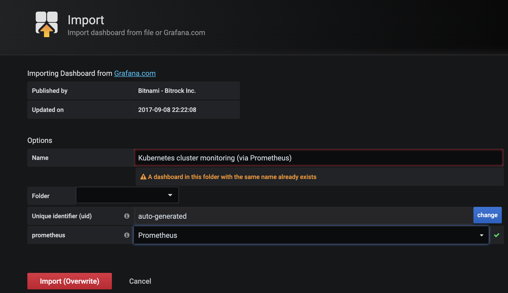
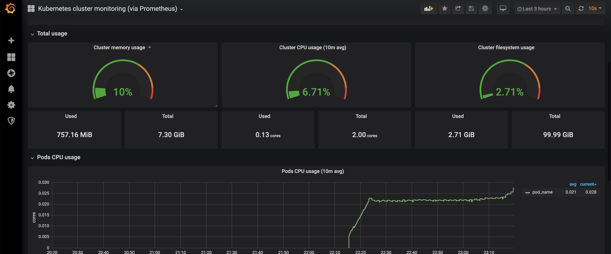
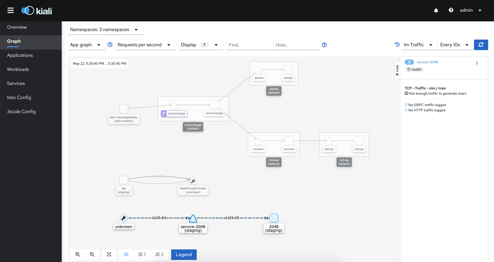

# 3. モニタリング
`demo` profileを使ってIstioをK8sクラスターにインストールした場合, `grafana`, `prometheus`, `kiali`, `jaeger`などのモニタリングツールもDeployされています。

```sh
# podをリストアップ
kubectl get pod -n istio-system

# アウトプット
NAME                                    READY   STATUS    RESTARTS   AGE
grafana-74dc798895-5wwk8                1/1     Running   0          22m
istio-egressgateway-7c6c6cd8b9-c87lz    1/1     Running   0          22m
istio-ingressgateway-5d869f5bbf-bvpxs   1/1     Running   0          22m
istio-tracing-8584b4d7f9-7wmsw          1/1     Running   0          22m
istiod-648555b9b7-qgtg9                 1/1     Running   0          23m
kiali-6f457f5964-9dhh9                  1/1     Running   0          22m
prometheus-7fb8c98b68-h2rfp             2/2     Running   0          22m
```

# 3.1 Grafana dashboardをチェック
```
istioctl dashboard grafana
```

## GrafanaのDashboardを紹介

ダッシュボードのテンプレをインポートする場合:

”＋” icon > dashboard ID `3119`をタイプ > ‘Prometheus’ をdata sourcesとしてDropdownから選択.




GrafanaのDashboardでいろんなMetricsがVisualizeされているのが見える



## 特に役立つGrafanaのコミュニティDashboard 

- [K8 Cluster Detail Dashboard](https://grafana.com/grafana/dashboards/10856)
- [K8s Cluster Summary](https://grafana.com/grafana/dashboards/8685)
- [Kubernetes cluster monitoring](https://grafana.com/grafana/dashboards/315)


# 3.2 Kiali Dashboardの紹介 
```
istioctl dashboard kiali
```

デフォルトのUsernameとpasswordは`admin`です。



KialiのDashboardについては後のチャプターで深く紹介していきます。