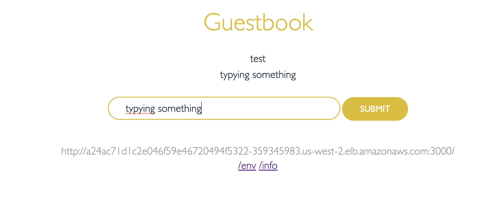
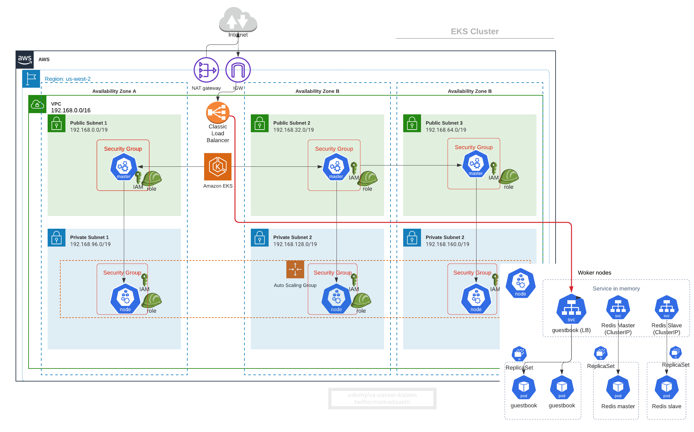
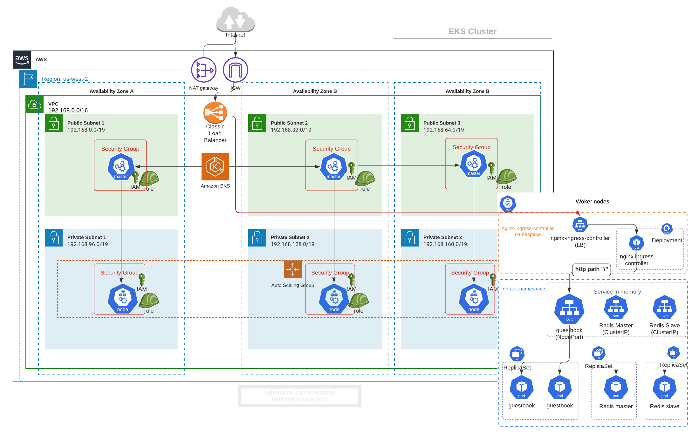
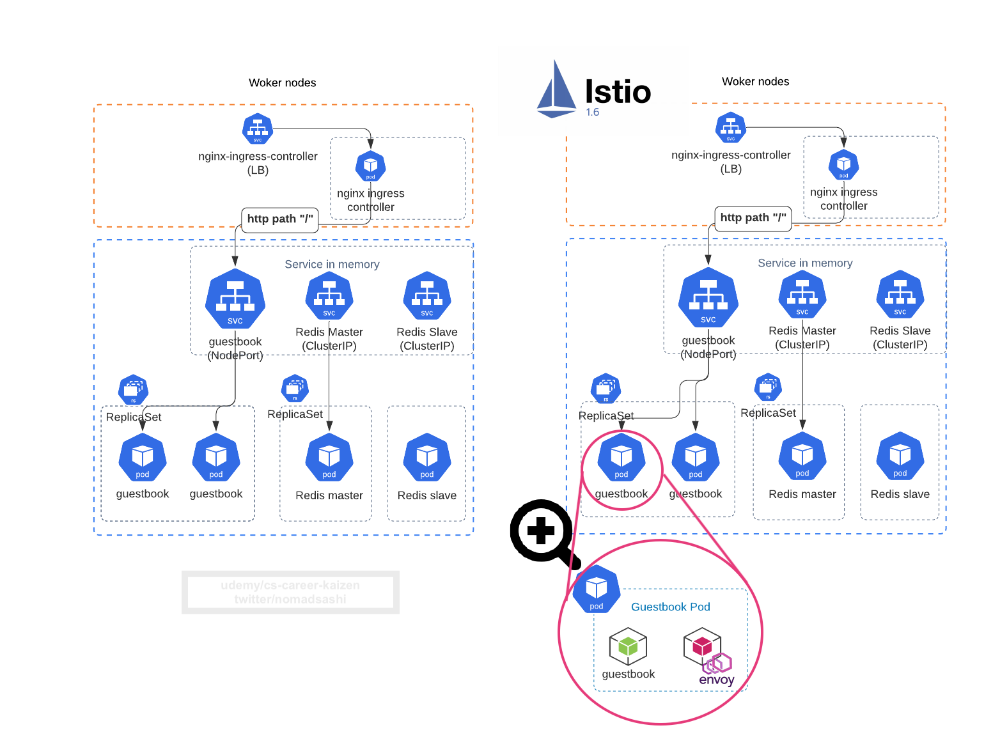

# 4. サンプルアプリをEKSクラスターにディプロイ

Refs: 
- https://github.com/kubernetes/examples/blob/master/guestbook-go/README.md


フロントエンドはPHP app
- PublicのAWSロードバランサー
- DBのReadリクエストは複数のSlave　Podsに負荷分散
- DBのWriteリクエストはMaster Podへ

バックエンドのRedis
- 1つのマスターPod (write)
- 複数のスレーブPods (read)

# 4.1 RedisのMaster Podとサービスをディプロイ
```
kubectl apply -f https://raw.githubusercontent.com/kubernetes/examples/master/guestbook-go/redis-master-controller.json

kubectl apply -f https://raw.githubusercontent.com/kubernetes/examples/master/guestbook-go/redis-master-service.json
```

# 4.2 RedisのSlave Podsとサービスをディプロイ
```
kubectl apply -f https://raw.githubusercontent.com/kubernetes/examples/master/guestbook-go/redis-slave-controller.json

kubectl apply -f https://raw.githubusercontent.com/kubernetes/examples/master/guestbook-go/redis-slave-service.json
```

# 4.3 フロントエンドアプリをディプロイ
```
kubectl apply -f https://raw.githubusercontent.com/kubernetes/examples/master/guestbook-go/guestbook-controller.json

kubectl apply -f https://raw.githubusercontent.com/kubernetes/examples/master/guestbook-go/guestbook-service.json
```

`replicationcontroller`を表示
```
kubectl get replicationcontroller
```

アウトプット
```
NAME           DESIRED   CURRENT   READY   AGE
guestbook      3         3         3       15m
redis-master   1         1         1       16m
redis-slave    2         2         2       15m
```

ServiceとPodを表示
```
kubectl get pod,service
```

アウトプット
```
NAME                     READY   STATUS    RESTARTS   AGE
pod/guestbook-dxkpd      1/1     Running   0          16m
pod/guestbook-fsqx8      1/1     Running   0          16m
pod/guestbook-nnrjc      1/1     Running   0          16m
pod/redis-master-6dbj4   1/1     Running   0          17m
pod/redis-slave-c6wtv    1/1     Running   0          16m
pod/redis-slave-qccp6    1/1     Running   0          16m

NAME                   TYPE           CLUSTER-IP      EXTERN
AL-IP
       PORT(S)          AGE
service/guestbook      LoadBalancer   10.100.36.45    a24ac7
1d1c2e046f59e46720494f5322-359345983.us-west-2.elb.amazonaws
.com   3000:30604/TCP   15m
service/kubernetes     ClusterIP      10.100.0.1      <none>

       443/TCP          158m
service/redis-master   ClusterIP      10.100.174.46   <none>

       6379/TCP         17m
service/redis-slave    ClusterIP      10.100.103.40   <none>

       6379/TCP         16m
```

# 4.4 外部に公開するELBのDNSを取得
```
$ echo $(kubectl  get svc guestbook | awk '{ print $4 }' | tail -1):$(kubectl  get svc guestbook | awk '{ print $5 }' | tail -1 | cut -d ":" -f 1
3000)

a24ac71d1c2e046f59e46720494f5322-359345983.us-west-2.elb.amazonaws.com:3000
```

３ー5分待った後にブラウザーからアクセス




# 4.5 図解でおさらい



# 4.6 Nginx Ingress Controllerをインストール
```
kubectl create namespace nginx-ingress-controller

helm repo add stable https://kubernetes-charts.storage.googleapis.com/
helm repo update
helm install nginx-ingress-controller stable/nginx-ingress -n nginx-ingress-controller
```


# 4.7 IngressリソースをYAMLで作成し、HTTPパスやホストによるL7ロードバランス

[ingress.yaml](ingress.yaml)
```yaml
apiVersion: extensions/v1beta1
  kind: Ingress
  metadata:
    annotations:
      kubernetes.io/ingress.class: nginx
    name: guestbook
    namespace: default
  spec:
    rules:
      - http:
          paths:
            - backend:
                serviceName: guestbook
                servicePort: 3000 
              path: /
```

アプライ
```bash
kubectl apply -f ingress.yaml
```

ロードバランサーのPublic DNSを`nginx-ingress-controller-controller` serviceを表示して取得
```bash
kubectl  get svc nginx-ingress-controller-controller -n nginx-ingress-controller | awk '{ print $4 }' | tail -1
```

アウトプット
```bash
# ブラウザーからアクセス
a588cbec4e4e34e1bbc1cc066f38e3e0-1988798789.us-west-2.elb.amazonaws.com
```


# 4.8 K8s Service (LoadBalancerタイプ)によって作成されたAWS ELBを削除

そして`guestbook` service を`LoadBalancer`から`NodePort`タイプへ変更.

まずは`guestbook` serviceのYAMLを表示
```bash
kubectl get svc guestbook -o yaml
```

アウトプット
```yaml
apiVersion: v1
kind: Service
metadata:
  annotations:
    kubectl.kubernetes.io/last-applied-configuration: |
      {"apiVersion":"v1","kind":"Service","metadata":{"annotations":{},"labels":{"app":"guestbook"},"name":"guestbook","namespace":"default"},"spec":{"ports":[{"port":3000,"targetPort":"http-server"}],"selector":{"app":"guestbook"},"type":"LoadBalancer"}}
  creationTimestamp: "2020-06-13T14:20:12Z"
  finalizers:
  - service.kubernetes.io/load-balancer-cleanup
  labels:
    app: guestbook
  name: guestbook
  namespace: default
  resourceVersion: "14757"
  selfLink: /api/v1/namespaces/default/services/guestbook
  uid: 24ac71d1-c2e0-46f5-9e46-720494f5322b
spec:
  clusterIP: 10.100.36.45
  externalTrafficPolicy: Cluster
  ports:
  - nodePort: 30604
    port: 3000
    protocol: TCP
    targetPort: http-server
  selector:
    app: guestbook
  sessionAffinity: None
  type: LoadBalancer
status:
  loadBalancer:
    ingress:
    - hostname: a24ac71d1c2e046f59e46720494f5322-359345983.us-west-2.elb.amazonaws.com
```

YAML内の`status`などのメタデータ情報を削除

[service_guestbook_nodeport.yaml](service_guestbook_nodeport.yaml)
```
apiVersion: v1
kind: Service
metadata:
  annotations:
  labels:
    app: guestbook
  name: guestbook
  namespace: default
spec:
  ports:
  - nodePort: 30605
    port: 3000
    protocol: TCP
    targetPort: http-server
  selector:
    app: guestbook
  type: NodePort
```

Serviceはアップデートができないので、一旦既存の`guestbook` serviceを削除
```bash
kubectl delete svc guestbook
```

新しいServiceを作成
```bash
kubectl apply -f service_guestbook_nodeport.yaml
```

`default` namespaceのServiceを表示
```bash
$ kubectl get svc

NAME           TYPE        CLUSTER-IP      EXTERNAL-IP   PORT(S)          AGE
guestbook      NodePort    10.100.53.19    <none>        3000:30605/TCP   20s
kubernetes     ClusterIP   10.100.0.1      <none>        443/TCP          3h38m
redis-master   ClusterIP   10.100.174.46   <none>        6379/TCP         77m
redis-slave    ClusterIP   10.100.103.40   <none>        6379/TCP         76m
```

ロードバランサーにアクセステスト
```bash
# visit the URL from browser
kubectl  get svc nginx-ingress-controller-controller -n nginx-ingress-controller | awk '{ print $4 }' | tail -1
```


# 4.9  図解でおさらい
1. `guestbook`の`LoadBalancer`Serviceタイプを`NodePort`へ変更
2. `guestbook` service の前に`nginx-ingress-controller`の`LoadBalancer`Serviceタイプを設置
3. `nginx-ingress-controller` podがL7負荷分散をする
4. これにより複数のServicesを1つのIngress Controller Serviceにバインドできる

__Before Ingress__


__After Ingress__



__With Istio Enabled__

