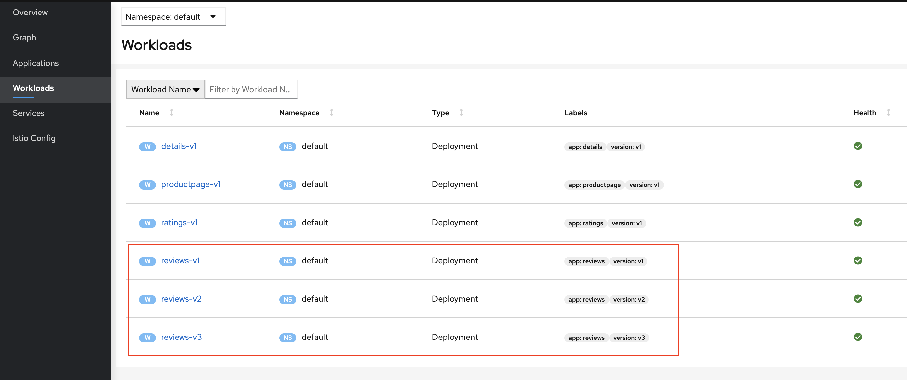
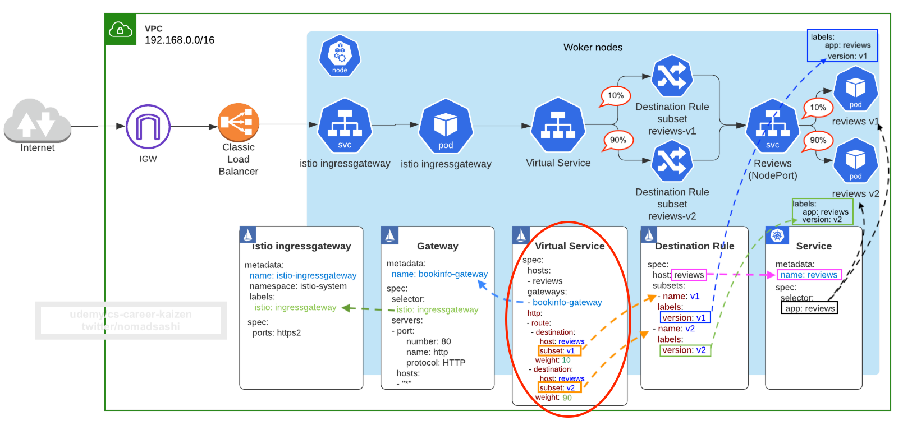
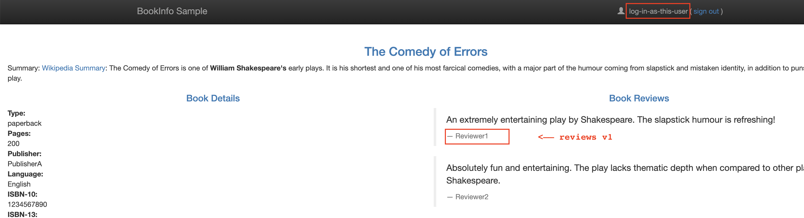
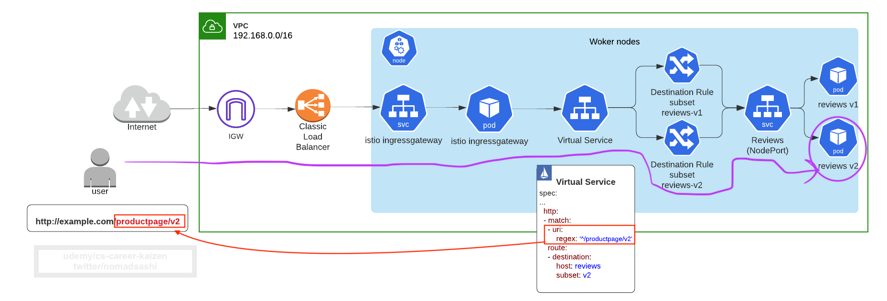
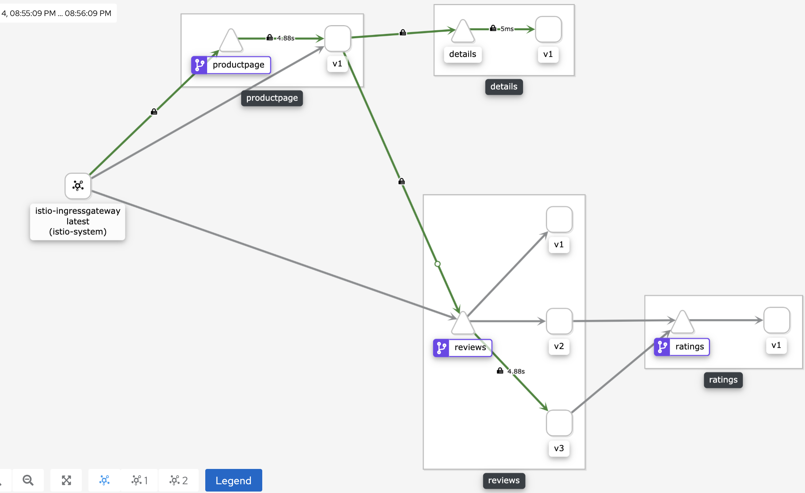

# 6. Traffic Management


# 6.1 Virtual Service Subsetを使って加重Routing(i.e. ％の割合によるrouting、Canary rollout)  


## Step 1: version labelをpodsに追加


```sh
# app=reviewsのラベルがついているpodのlabelを表示 
kubectl get pod --show-labels --selector app=reviews

# アウトプット
NAME                          READY   STATUS    RESTARTS   AGE   LABELS
reviews-v1-7f6558b974-wtmj8   2/2     Running   0          23h   app=reviews,istio.io/rev=default,pod-template-hash=7f6558b974,security.istio.io/tlsMode=istio,service.istio.io/canonical-name=reviews,service.istio.io/canonical-revision=v1,version=v1
reviews-v2-6cb6ccd848-hrpbg   2/2     Running   0          23h   app=reviews,istio.io/rev=default,pod-template-hash=6cb6ccd848,security.istio.io/tlsMode=istio,service.istio.io/canonical-name=reviews,service.istio.io/canonical-revision=v2,version=v2
reviews-v3-cc56b578-dg7gq     2/2     Running   0          23h   app=reviews,istio.io/rev=default,pod-template-hash=cc56b578,security.istio.io/tlsMode=istio,service.istio.io/canonical-name=reviews,service.istio.io/canonical-revision=v3,version=v3
```

3つの `reviews` podsがそれぞれ、 `version=v1`, `version=v2`, `version=v3`のラベルがあることがわかる。これらのPodは3つのdeploymentから作成されています。

```sh
kubectl get deploy --selector app=reviews

# アウトプット
NAME         READY   UP-TO-DATE   AVAILABLE   AGE
reviews-v1   1/1     1            1           23h
reviews-v2   1/1     1            1           23h
reviews-v3   1/1     1            1           23h
```

`Kiali` dashboardからもこれらのDeploymentを確認できます
```sh
# kiali dashboardをアクセス
istioctl dashboard kiali
```



この3つのPodは、1つのService（`app=reviews` label）によってProxyされています
```sh
# reviews serviceとそのlabelを表示
kubectl get svc reviews --show-labels

# アウトプット
NAME      TYPE        CLUSTER-IP     EXTERNAL-IP   PORT(S)    AGE   LABELS
reviews   ClusterIP   10.100.5.108   <none>        9080/TCP   23h   app=reviews,service=reviews
```


## Step 2: Istio DestinationRuleでSubsetを作成


### DestinationRule YAMLの解剖

[destination_rules_versioning.yaml](destination_rules_versioning.yaml),
```yaml
apiVersion: networking.istio.io/v1alpha3
kind: DestinationRule
metadata:
  name: reviews
spec:
  host: reviews # K8s serviceの名前か外部のホスト名（ただし、Istio Service Entryで登録されている必要あり）
  trafficPolicy: # serviceレベルのtraffic policy
      loadBalancer:
        simple: ROUND_ROBIN # デフォルト
  subsets: # SubsetはVersionと同義。それぞれのVersionごとにRoutingポリシーなど設定可能
  - name: v1 # <--- named version/subset
    labels:
      version: v1 # Podにつけられたlabel
  - name: v2
    labels:
      version: v2
  - name: v3
    labels:
      version: v3
```

- host
    - service registryに登録されているservice名 
    - __クラスター内の__ service: K8s service名
    - __外部の__ service:  __ServiceEntries__ で追加された名前
- trafficPolicy（Serviceレベル）
    - load balancing ポリシー
        - round robin, random, least connection
    - connection pool sizes
        - コネクションの数をコントロール
    - outlier detection
        - unhealthyなホストを除外するポリシー
- subset
    - それぞれのServiceのバージョンの __named sets__
    - trafficPolicy
        - subsetレベルで上書き可能


ディプロイ 
```sh
kubectl apply -f destination_rules_versioning.yaml

# チェック
kubectl get dr
NAME      HOST      AGE
reviews   reviews   5s
```


## Step 3: Virtual Serviceのroute destinationにSubsetとWeight（割合）を設定



[virtualservice_reviews_canary.yaml](virtualservice_reviews_canary.yaml),
```yaml
apiVersion: networking.istio.io/v1alpha3
kind: VirtualService
metadata:
  name: reviews
spec:
  hosts:
  - reviews
  gateways: 
  - bookinfo-gateway
  - mesh # このVirtualServiceのルールをGatewayのみならず、Mesh内のそれぞれのアプリのSidecar Envoy Proxyにも適用する 
  http: # L7 load balancing
  - route:
    - destination:
        host: reviews
        subset: v1
      weight: 10 # <--- canaryリリース。 １０%のTrafficがsubset v1へ
    - destination:
        host: reviews
        subset: v2
      weight: 10
    - destination:
        host: reviews
        subset: v3
      weight: 80
```

アプライ 
```sh
kubectl apply -f virtualservice_reviews_canary.yaml

# チェック
kubectl get vs
NAME      HOST      AGE
reviews   reviews   5s
```


## Step 4: Canary Traffic Splittingをテスト
ブラウザーからBookinfoのURLをアクセスすると、 10%ずつのリクエストがv１のreviews(スター無し)とv2 (黒いスター)に行き、80%がv3 (赤いスター)に行くのが確認できる

```sh
echo $(kubectl -n istio-system get service istio-ingressgateway -o jsonpath='{.status.loadBalancer.ingress[0].hostname}')/productpage

# ブラウザーからアクセス
a5a1acc36239d46038f3dd828465c946-706040707.us-west-2.elb.amazonaws.com/productpage
```


```sh
# kiali dashboardを表示
istioctl dashboard kiali
```

`kiali` dashboard -> Graph -> `default` namespaceを選択 > ”Display” dropdownをクリックし"Traffic Animation"をチェックオフ


するとdashboardがrequestの％を表示します


他にも、Service > Reviews > Tracesからrequest tracing/metricsが見れます 


# 6.2 HTTP HeaderのIdentityによるRouting
Ref: https://istio.io/latest/docs/reference/config/networking/virtual-service/#HTTPMatchRequest


[virtualservice_reviews_header_condition_identity_based.yaml](virtualservice_reviews_header_condition_identity_based.yaml),
```yaml
apiVersion: networking.istio.io/v1alpha3
kind: VirtualService
metadata:
  name: reviews
spec:
  hosts: 
  - reviews
  gateways:
  - bookinfo-gateway 
  - mesh # このVirtualServiceのルールをGatewayのみならず、Mesh内のそれぞれのアプリのSidecar Envoy Proxyにも適用する 
  http: 
  - match: # <---- 下記のユーザーからのリクエストに対して、Routingルールを適用
    - headers:
        end-user: # 注釈: このkey-valueペアをcurlから-HオプションでPassしてもうまくRoutingされません。その理由は、このHeaderの情報がProductPageからReviewsアプリにPropagateされないからです。これをテストするには、Bookinfoページでこのユーザーとしてログインする必要があります Ref: https://stackoverflow.com/a/50878208/1528958
          exact: log-in-as-this-user
    route:
    - destination:
        host: reviews
        subset: v1 # 上記のユーザーからのリクエストをv１のReviews serviceへRouting
  - route:
    - destination:
        host: reviews
        subset: v1
      weight: 10 # <--- canary release. １０%のtrafficをsubset v1へ
    - destination:
        host: reviews
        subset: v2
      weight: 10
    - destination:
        host: reviews
        subset: v3
      weight: 80
  # - match: # <---- アンチパターン： Ruleは上から下に順番にEvaluateされるので、ここの最後に条件を定義するべきではありません。
  #   - headers:
  #       end-user:
  #         exact: tester
  #   route:
  #   - destination:
  #       host: reviews
  #       subset: v1
```

この部分で条件を追加しています
```yaml
- match:
   - headers:
       end-user:
         exact: log-in-as-this-user
```

アプライ
```
kubectl apply -f virtualservice_reviews_header_condition_identity_based.yaml 
```

## テストの仕方
#### Warning: このkey-valueペアをcurlから-HオプションでPassしてもうまくRoutingされません。その理由は、このHeaderの情報がProductPageからReviewsアプリにPropagateされないからです。これをテストするには、Bookinfoページでこのユーザーとしてログインする必要があります 
Ref: https://stackoverflow.com/a/50878208/1528958

### うまくいかない方法:
~~ブラウザーから, `ModHeader` chromeプラグインをインストールし、HTTP headerを設定~~


~~ChromeのDevツールでHTTP　Headerを表示する~~


~~curlでheaderの情報を"--header"で追加~~
```sh
for i in {1..20}; do curl --verbose \
    --header "end-user: log-in-as-this-user" \
    $(echo $(kubectl -n istio-system get service istio-ingressgateway -o jsonpath='{.status.loadBalancer.ingress[0].hostname}')/productpage); done
```


### うまくいく方法:
Bookinfoページでこのユーザーとしてログイン



Kialiで、trafficがv１のreviewsにRoutingされているのがわかる


# 6.3 Query StringによるRouting


[virtualservice_reviews_header_condition_query_string.yaml](virtualservice_reviews_header_condition_query_string.yaml),
```yaml
  http: 
  - match:
    - queryParams: # <----- query parameter
        test-v2:
          exact: "true" # もし "?test-v2=true" がQuery Stringにある場合
    route:
    - destination:
        host: reviews
        subset: v2 #v２のReviews serviceへRouting
```

しかし, `productpage`アプリはheaderの情報（query string parameters含む）をDownstreamの`reviews` に渡さないので, このQuery StringはBookinfoアプリではテストできません。


# 6.4 URI (HTTP path)によるRouting




[virtualservice_reviews_header_condition_uri.yaml](virtualservice_reviews_header_condition_uri.yaml),
```yaml
  http: 
  - match:
    - uri:
        regex: '^/productpage/v2' # Keyのオプションは exact|prefix|regex
      ignoreUriCase: true
    route:
    - destination:
        host: reviews
        subset: v2 #v２のReviews serviceへRouting
```

しかし, `productpage`アプリはheaderの情報（URI含む）をDownstreamの`reviews` に渡さないので, このQuery StringはBookinfoアプリではテストできません。


# 6.5 VirtualServiceからDelayをInjectしてResilienceをテストする 
Refs: 
- https://istio.io/latest/docs/reference/config/networking/virtual-service/#HTTPFaultInjection-Delay
- https://istio.io/latest/docs/concepts/traffic-management/#fault-injection


> Delays: Delays are timing failures. They mimic increased network latency or an overloaded upstream service

[virtualservice_ratings_fault_injection_delay.yaml](virtualservice_ratings_fault_injection_delay.yaml),
```yaml
apiVersion: networking.istio.io/v1alpha3
kind: VirtualService
metadata:
  name: ratings
spec:
  hosts: 
  - ratings
  http: 
  - match:
    - headers: 
        end-user:
          exact: tester
    fault: 
      delay: # <------ Delayを追加
        percentage:
          value: 100.0 # [0.0, 100.0]のレンジの％。 Ref: https://istio.io/latest/docs/reference/config/networking/virtual-service/#Percent
        fixedDelay: 10s # <----- delayを１０秒と定義
    route:
    - destination:
        host: ratings
        subset: v1
  - route:
    - destination:
        host: ratings
        subset: v1
```

アプライ 
```
kubectl apply -f virtualservice_ratings_fault_injection_delay.yaml
```

`tester`としてログインすると、Bookinfoページがloadするのに __7-10秒__ くらいかかるのがわかる。 ただ、Reviewsのセクションにエラーが表示されているのもわかる（`Sorry, product reviews are currently unavailable for this book.`）

リクエストのフローは：
Productpage　＞　Reviews　＞　Ratings
となっていて、

`productpage`がタイムアウトエラー (デフォルトでは、Productpageのアプリのコードで3秒 x 1 retry = 7秒)を`reviews` serviceから受け取って、エラーをReviewsセクションに表示している。またReviewsが`ratings` serviceの１０秒のDelayを待ちきれずタイムアウトもしているが、その前に`productpage`のタイムアウトエラーがページに先に表示しています。


```
productpage -> (3s timeout x 1 retry = max 6s) -> reviews -> ratings with 10s delay
```


この７秒のdelayを、Chromeの Developer Tools menu > Network tab > リロード　/productpage web pageで見ることもできます


Kiali


## なぜ10秒のDelayを設定したのに、7秒後にタイムアウトするのか
Ref: https://istio.io/latest/docs/tasks/traffic-management/fault-injection/#understanding-what-happened

> Timeout between the `reviews` and `ratings` service is __hard-coded at 10s__. However, there is also a hard-coded timeout between the `productpage` and the `reviews` service, coded as __3s + 1 retry for 6s__ total. As a result, the productpage call to reviews times out prematurely and throws an error after __6s__.


# 6.6 VirtualServiceからHTTP Responseコードを指定して、Resilienceをテストする 
Refs: 
- https://istio.io/latest/docs/reference/config/networking/virtual-service/#HTTPFaultInjection-Abort
- https://istio.io/latest/docs/concepts/traffic-management/#fault-injection


Abortsとはcrash failuresのことです。Abort（HTTPエラーコード）でBackendのfailuresをSimulateします。

[virtualservice_ratings_fault_injection_abort.yaml](virtualservice_ratings_fault_injection_abort.yaml),
```yaml
apiVersion: networking.istio.io/v1alpha3
kind: VirtualService
metadata:
  name: ratings
spec:
  hosts: 
  - ratings
  http: 
  - match:
    - headers: 
        end-user: 
          exact: tester
    fault: 
      abort: # <----- リターンするHTTPコードを設定
        percentage:
          value: 100.0 # [0.0, 100.0]のレンジの％。 Ref: https://istio.io/latest/docs/reference/config/networking/virtual-service/#Percent
        httpStatus: 400
    route:
    - destination:
        host: ratings
        subset: v1
  - route:
    - destination:
        host: ratings
        subset: v1
```


アプライ 
```
kubectl apply -f virtualservice_ratings_fault_injection_abort.yaml
```

`tester`としてログインすると, ページは __すぐに__ ロードするが、`Ratings service is currently unavailable` のメッセージが表示されているのがわかる


Kialiダッシュボードで、`reviews` podから`ratings` serviceへの接続が赤線（エラー）になっているのがわかる


# 6.7 VirtualServiceでTimeoutを指定して、Resilienceをテストする 
Refs:
- https://istio.io/latest/docs/tasks/traffic-management/fault-injection/#injecting-an-http-abort-fault
- https://istio.io/latest/docs/concepts/traffic-management/#timeouts
- https://istio.io/latest/docs/tasks/traffic-management/request-timeouts/


Timeoutとは、どれだけの時間Envoy proxyが指定されたServiceからのリスポンスを待つかで, これにより半永久的にリスポンスを待つまでLoadingすることを防げます。__HTTP requestsのデフォルトのTimeoutは15秒で__, もしServiceが15秒以内にReturnしない場合は, Requestが失敗しHTTPエラーコードがReturnされます。

[virtualservice_reviews_timeout.yaml](virtualservice_reviews_timeout.yaml),
```yaml
apiVersion: networking.istio.io/v1alpha3
kind: VirtualService
metadata:
  name: reviews
spec:
  hosts:
  - reviews
  gateways: 
  - bookinfo-gateway 
  - mesh 
  http: 
  - timeout: 1s # <--- default timeout for HTTP requests is 15 seconds, which means that if the service doesn’t respond within 15 seconds, the call fails
    route:
    - destination:
        host: reviews
        subset: v1
      weight: 10 # <--- canary release. % of traffic to subset v1
    - destination:
        host: reviews
        subset: v2
      weight: 10
    - destination:
        host: reviews
        subset: v3
      weight: 80
```

アプライ
```
kubectl apply -f virtualservice_ratings_fault_injection_delay.yaml

kubectl apply -f virtualservice_reviews_timeout.yaml
```

ブラウザーからアクセスすると、ページがLoadするまで2秒ほどかかるのがわかります。この理由は、Timeoutが1秒に設定されているが、 __productpageアプリ内でRetryがHardcodeされているので__, reviews serviceに対して __２回__ リクエストを送っています。

また`productpage` __のアプリ内でtimeoutが3秒__ に設定されているので、それ以上長いTimeoutをVirtualServiceで設定しても、アプリ内のTimeoutが優先されます。（ただしBookinfoのアプリ特有の設定）


アプライ
```
kubectl apply -f virtualservice_ratings_timeout.yaml
```

ブラウザーからアクセス




# 6.8 VirtualServiceでRetryを指定して、Resilienceをテストする 
Refs:
- https://istio.io/latest/docs/reference/config/networking/virtual-service/#HTTPRetry
- https://istio.io/latest/docs/concepts/traffic-management/#retries
- https://www.envoyproxy.io/docs/envoy/latest/configuration/http/http_filters/router_filter#x-envoy-retry-on


最大で3回のretriesと, １回のRetryに対して2秒のtimeoutの設定をする
```yaml
apiVersion: networking.istio.io/v1alpha3
kind: VirtualService
metadata:
  name: ratings
spec:
  hosts: 
  - ratings
  http: 
  - retries:
      attempts: 3 # default 1. The number of retries for a given request. The interval between retries will be determined automatically (25ms+). Actual number of retries attempted depends on the request timeout
      perTryTimeout: 3s
      retryOn: 5xx,gateway-error,reset,connect-failure,refused-stream,retriable-4xx # https://www.envoyproxy.io/docs/envoy/latest/configuration/http/http_filters/router_filter#x-envoy-retry-on
    match:
    - headers: 
        end-user:
          exact: tester
    fault: 
      delay: 
        percentage:
          value: 100.0
        fixedDelay: 15s
    route:
    - destination:
        host: ratings
        subset: v1
  - route:
    - destination:
        host: ratings
        subset: v1
```

この設定で、３回のretryと3秒のtimeout/retry（3秒x(1回目+3回)=12秒）を指定しているが, `productpage`内でHardcodeされた設定が、3秒のTimeoutと1会のretry（(3秒x(1回目+1回))=6秒）なので, `reviews` serviceが`ratings`からResponseを得る前に、6秒後に`productpage`がTimeoutエラーを表示します。


# 6.9 Live Trafficをコピーする
Refs:
- https://istio.io/latest/docs/tasks/traffic-management/mirroring/
- https://istio.io/latest/docs/reference/config/networking/virtual-service/#HTTPRoute


RequestをMirrorする時は、MirrorするServiceに送られる元のRequestのHost/Authority headersに __-shadow__ が追加されます。例えば、元のホストが`cluster-1`だった場合は、`cluster-1-shadow`になります。

In [virtualservice_reviews_mirror.yaml](virtualservice_reviews_mirror.yaml),
```yaml
apiVersion: networking.istio.io/v1alpha3
kind: VirtualService
metadata:
  name: reviews
spec:
  hosts:
  - reviews
  gateways: 
  - bookinfo-gateway 
  - mesh 
  http: 
  - mirror: # <---- mirror traffic going to v3 to v1 as well, 100% of it
      host: reviews
      subset: v1
    mirror_percent: 100.0 # use double. https://istio.io/latest/docs/reference/config/networking/virtual-service/#HTTPRoute
    route:
    - destination:
        host: reviews
        subset: v3
      weight: 100
```

アプライ
```sh
# apply normal ratings virtual service without delay nor abort
kubectl apply -f virtualservice_ratings.yaml 

kubectl apply -f virtualservice_reviews_mirror.yaml 
```

URLをブラウザーからアクセス

Trafficがv3のReviewsに行っているのがわかる:


またv1へTrafficがコピーされているのもわかる:


v1's istio proxy logで、 __header host__ に`-shadow`が追加されているのが確認できる


ただ、v2にはTrafficが送られていないのもわかる


# 6.10 Destination Ruleを使ってLoad Balancingポリシーを設定する
Refs:
- https://istio.io/latest/docs/concepts/traffic-management/#destination-rule-example
- https://istio.io/latest/docs/reference/config/networking/destination-rule/


> Destination Rule defines policies that apply to traffic intended for a service after routing has occurred


Destination Ruleで以下の設定が可能:
- load balancing ポリシー
    - round robin, random, least connection
- connection pool sizes
    - コネクションの数をコントロール
- outlier detection
    - unhealthyなホストを除外するポリシー

Istio DestinationRuleの Traffic Policy無しでは, K8s serviceの L4 load balancing (デフォルトのround robin)に限られてしまいます。

Istio DestinationRuleのTraffic Policyにより、 __より詳細なロードバランシングポリシー__ を設定できます。 （__round robin__, __random__, __least-connection__, __sticky sessions__）


## Round Robin Load Balancing (デフォルト)
```yaml
apiVersion: networking.istio.io/v1alpha3
kind: DestinationRule
metadata:
  name: reviews
spec:
  host: reviews 
#   trafficPolicy: # serviceレベル routingポリシー
#       loadBalancer:
#         simple: ROUND_ROBIN # デフォルトなので、設定する必要無し
```

## Random Load Balancing
health checkingポリシーが設定されていない場合、Round RobinよりもRandomの方がパフォーマンスは良い

```yaml
apiVersion: networking.istio.io/v1alpha3
kind: DestinationRule
metadata:
  name: reviews
spec:
  host: reviews
  trafficPolicy: 
      loadBalancer:
        simple: RANDOM # HealthyなホストをRandomに選択
```

## Least request load balancing
O(1)コンスタントalgorithmを使って、ランダムに選ばれた2つのhealthyなホストからより少ないConnection数のホストを選択
```yaml
apiVersion: networking.istio.io/v1alpha3
kind: DestinationRule
metadata:
  name: reviews
spec:
  host: reviews
  trafficPolicy:
      loadBalancer:
        simple: LEAST_CONN # ランダムに選ばれた2つのhealthyなホストからより少ないConnection数のホストを選択
```

## 複数のLoad Balancing Rulesを設定
下記のYAMLで設定することは:
- serviceレベルの`loadBalancer`のtrafficPolicyで`ROUND_ROBIN`を指定
- versionレベルの`loadBalancer`のtrafficPolicyで`LEAST_CONN`をsubset `v1`で指定
- subset `v2`には`RANDOM`を指定 

```yaml
apiVersion: networking.istio.io/v1alpha3
kind: DestinationRule
metadata:
  name: reviews
spec:
  host: reviews 
  trafficPolicy: # serviceレベルのtraffic policy
    loadBalancer:
      simple: ROUND_ROBIN # デフォルトなので厳密には指定する必要なし
  subsets:
  - name: v1
    labels:
      version: v1
    trafficPolicy: # VersionレベルのPolicyはserviceレベルのtraffic policyを上書きする
      loadBalancer:
        simple: LEAST_CONN
  - name: v2
    labels:
      version: v2
    trafficPolicy: # VersionレベルのPolicyはserviceレベルのtraffic policyを上書きする
      loadBalancer:
        simple: RANDOM
```


# 6.11 ロードバランサーのSticky SessionをDestinationRuleで有効化する
```yaml
apiVersion: networking.istio.io/v1alpha3
kind: DestinationRule
metadata:
  name: reviews
spec:
  host: reviews # name of a service from the service registry
  trafficPolicy: # service-level routing policy
    loadBalancer:
        consistentHash: # <--- changed from "simple"
            httpCookie:
                name: user # Name of the cookie.
                ttl: 1800s # Lifetime of the cookie
```


# 6.12 DestinationRuleでConnection Pool sizesを設定して、Rate Limitingを有効化する
Connection pool settingsはTCPとHTTPレベルの両方で設定可能です。 

例えば、下記のYAMLはMaxで１つのconnectionと30msのタイムアウトを設定しています。

```yaml
apiVersion: networking.istio.io/v1alpha3
kind: DestinationRule
metadata:
  name: reviews
spec:
  host: reviews 
  trafficPolicy: 
      connectionPool: # <------  ref: https://istio.io/latest/docs/reference/config/networking/destination-rule/#ConnectionPoolSettings
        http:
          http2MaxRequests: 1 # concurrent HTTP2 requestsを1つに制限
          maxRequestsPerConnection: 1
        tcp:
          maxConnections: 2 # connection pool size of 2 HTTP1 connections
          connectTimeout: 30ms
          tcpKeepalive:
            time: 7200s
            interval: 75s
```


# 6.13 DestinationRuleでOutlierDetectionを設定してCircuit Breakerを有効化する
Refs:
- https://istio.io/latest/docs/tasks/traffic-management/circuit-breaking/
- https://istio.io/latest/docs/concepts/traffic-management/#circuit-breakers


このYAMLでは, Hostを1秒ごとにスキャンし、一回以上502, 503, 504エラーコードを出したホストを３分間退去させます。

In [destination_rules_productpage_circuit_breaker.yaml](destination_rules_productpage_circuit_breaker.yaml),
```yaml
apiVersion: networking.istio.io/v1alpha3
kind: DestinationRule
metadata:
  name: productpage
spec:
  host: productpage 
  trafficPolicy: 
      connectionPool: 
        http:
          http2MaxRequests: 1 # concurrent HTTP2 requestsを1つに制限
          maxRequestsPerConnection: 1
        tcp:
          maxConnections: 2 # connection pool size of 2 HTTP1 connections
          connectTimeout: 30ms
          tcpKeepalive:
            time: 7200s
            interval: 75s
      outlierDetection: # <-----  ref: https://istio.io/latest/docs/reference/config/networking/destination-rule/#OutlierDetection
        consecutiveErrors: 1 # １回以上エラーの場合
        interval: 1s # 1秒ごとにスキャン
        baseEjectionTime: 3m # ３分間退去
```

アプライ 
```
kubectl apply -f destination_rules_productpage_circuit_breaker.yaml
```

Kiali Dashboardで、Circuit Breakerアイコンが`productpage`のPodの下に見えるようになります:


## Circuit Breakerのテストの仕方

fortio（ストレステストするApache Benchツールに似ている）というpodを作成
```sh
kubectl apply -f ../istio-1.6.7/samples/httpbin/sample-client/fortio-deploy.yaml

# bookinfoのproductpage URLにCurlする
FORTIO_POD=$(kubectl get pods -lapp=fortio -o 'jsonpath={.items[0].metadata.name}')
echo $FORTIO_POD

BOOKINFO_URL=$(echo $(kubectl -n istio-system get service istio-ingressgateway -o jsonpath='{.status.loadBalancer.ingress[0].hostname}')/productpage)
echo $BOOKINFO_URL

kubectl exec -it "$FORTIO_POD" -c fortio -- /usr/bin/fortio load -curl "$BOOKINFO_URL"
```

大量のHTTPリクエストを送ってみる
```sh
# 2つのconcurrent connections (-c 2) と 20個のrequests (-n 20)
kubectl exec -it "$FORTIO_POD" -c fortio -- /usr/bin/fortio load -c 2 -qps 0 -n 20 -loglevel Warning "$BOOKINFO_URL"

# アウトプット
15:49:54 I logger.go:114> Log level is now 3 Warning (was 2 Info)
Fortio 1.6.5 running at 0 queries per second, 2->2 procs, for 20 calls: a5a1acc36239d46038f3dd828465c946-706040707.us-west-2.elb.amazonaws.com/productpage
15:49:54 W http_client.go:143> Assuming http:// on missing scheme for 'a5a1acc36239d46038f3dd828465c946-706040707.us-west-2.elb.amazonaws.com/productpage'
Starting at max qps with 2 thread(s) [gomax 2] for exactly 20 calls (10 per thread + 0)
Ended after 624.901397ms : 20 calls. qps=32.005
Aggregated Function Time : count 20 avg 0.060465896 +/- 0.01994 min 0.025406513 max 0.086700868 sum 1.20931791
# range, mid point, percentile, count
>= 0.0254065 <= 0.03 , 0.0277033 , 15.00, 3
> 0.03 <= 0.035 , 0.0325 , 25.00, 2
> 0.05 <= 0.06 , 0.055 , 30.00, 1
> 0.06 <= 0.07 , 0.065 , 65.00, 7
> 0.07 <= 0.08 , 0.075 , 90.00, 5
> 0.08 <= 0.0867009 , 0.0833504 , 100.00, 2
# target 50% 0.035
# target 75% 0.07
# target 90% 0.08
# target 99% 0.0927821
# target 99.9% 0.0934081
Sockets used: 11 (for perfect keepalive, would be 2)
Jitter: false
Code 200 : 10 (50.0 %)
Code 503 : 10 (50.0 %) # <------- 50％が5xxエラー
Response Header Sizes : count 20 avg 84 +/- 84 min 0 max 168 sum 1680
Response Body/Total Sizes : count 20 avg 2811.3 +/- 2536 min 275 max 5351 sum 56226
All done 20 calls (plus 0 warmup) 38.917 ms avg, 31.2 qps
```

circuit breakingのおかげで、半分のリクエストがエラーになったのがわかる
```sh
Code 200 : 10 (50.0 %)
Code 503 : 10 (50.0 %) # <------- half returning 5xx
```