# 4. Hello WorldでKubernetesの一連作業フローを理解しよう

## 4.1 K8s Master-Node アーキテクチャとは？ (kubectl client vs API server)


## 4.2 K8s Kubectlとは？
クラスターのMaster API Serverエンドポイントを表示
```
kubectl cluster-info
```

クラスターNodeを表示
```
kubectl get nodes
```

クラスターエンドポイントとCA cert、そしてユーザーのTLS keyを表示
```
kubectl config view
```

アウトプット
```
apiVersion: v1
kind: Config
clusters:
- cluster:
    certificate-authority: /Users/USERNAME/.minikube/ca.crt
    server: https://192.168.64.4:8443
  name: minikube
contexts:
- context:
    cluster: minikube
    user: minikube
  name: minikube
current-context: minikube
users:
- name: minikube
  user:
    client-key: /Users/USERNAME/.minikube/profiles/minikube/client.key
```

## 4.3 POD: helloworldコンテナをk8s Podで起動、Dockerコマンドとの比較 (Start k8s pod)
### Pod definition & diagram
- Podはコンテナをグループ化して、IPとVolumeを共有する仮想ホストのような働き
- PodはMatrixのネオが生まれてくる時のポッド
- ref: https://ubiteku.oinker.me/2017/02/21/docker-and-kubernetes-intro/
- Pod – 管理上の基本単位、仮想NICを共有（同じIP、同じVolumeファイルシステム）、同一Nodeに配置される. Pod は Kubernetes 上でホストに相当する単位です


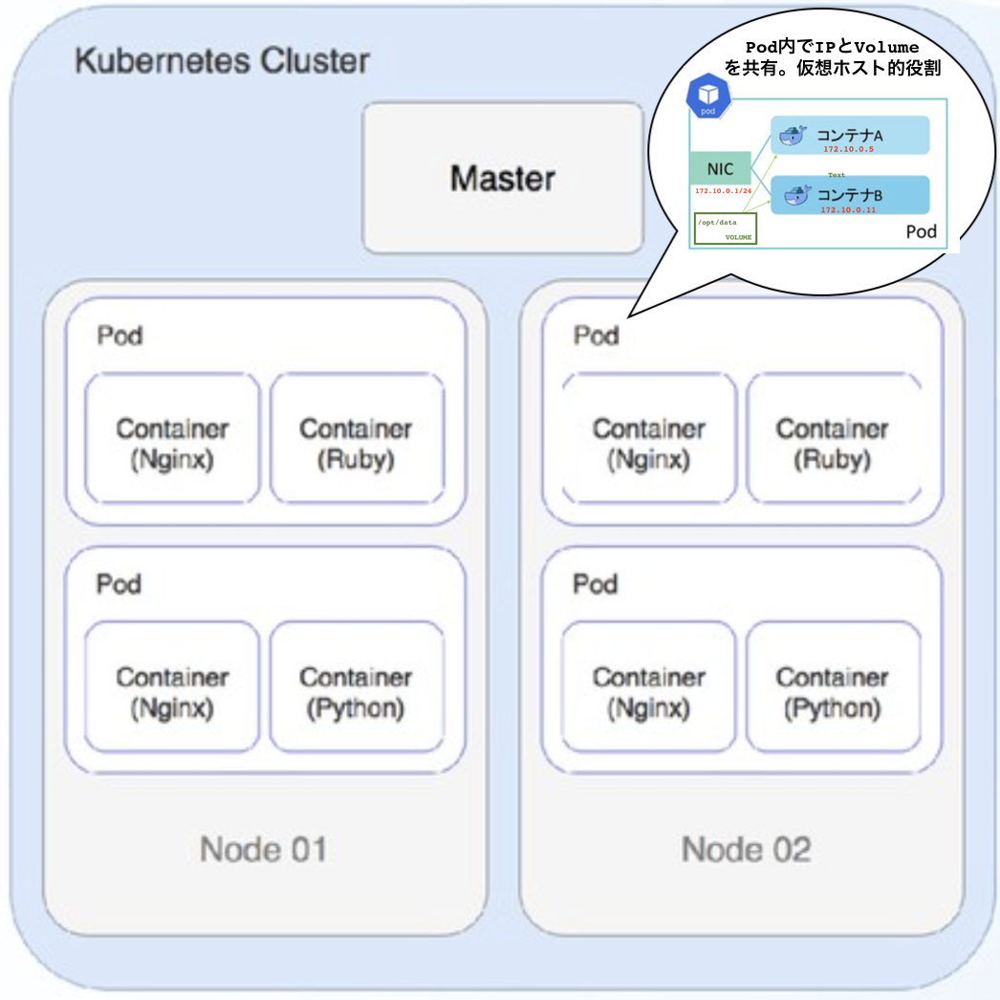

それではPodを使って、Hello Worldをk8sにDeployしよう

- もう1つのシェルでPodとServiceをWatch
```
watch 'kubectl get pod,svc -o wide'
```
- Hello WorldのPodを起動
```
# docker run -p 800:8080 --name helloworld gcr.io/google-samples/hello-app:1.0

kubectl run --image gcr.io/google-samples/hello-app:1.0 --restart Never helloworld
```
- Podを表示 (List)
```
# docker ps

kubectl get pods
```
- Pod内のログを表示 (Log)
```
# docker logs helloworld

kubectl logs helloworld
```
- Podのメタデータを見てみる 
```
# docker inspect helloworld

kubectl describe pod helloworld
```
- 作動中のコンテナの中にシェルで入る (Exec) `exec -it`
```
# docker exec -it helloworld sh

kubectl exec -it helloworld sh
```
- Podを削除
```
# docker rm helloworld

kubectl delete pod helloworld
```
- コンテナの環境変数を設定する `--env TEST_ENV=hellow_world`
```
# docker run --env TEST_ENV=hellow_world -d --name helloworld helloworld

kubectl run --env TEST_ENV=hellow_world --image gcr.io/google-samples/hello-app:1.0 --restart Never helloworld

kubectl exec -it helloworld env
kubectl delete pod helloworld
```
- コンテナに繋げるホスト側のポートを変える `-p 8080:8080`
```
# docker run -p 8080:8080 -d --name helloworld helloworld

kubectl run --port 8080 --image gcr.io/google-samples/hello-app:1.0 --restart Never helloworld
```

- クラスター内の他のPodから、HelloWorld Podへのアクセスをテスト
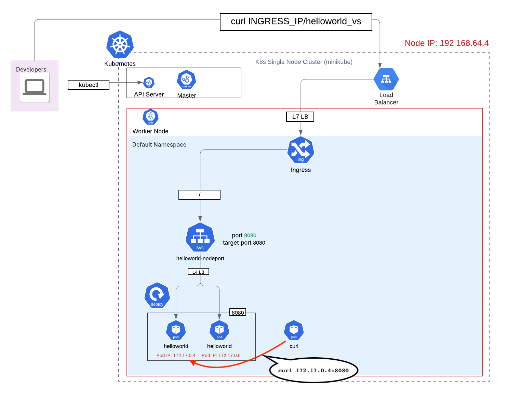

```
kubectl run --restart Never --image curlimages/curl:7.68.0 -it --rm curl sh

# curl helloworld pod
curl 172.17.0.4:8080

Hello, world!
Version: 1.0.0
Hostname: helloworld
```

- Pod IPを取得し、ホストOSから<strong>Curlするが接続できない</strong>
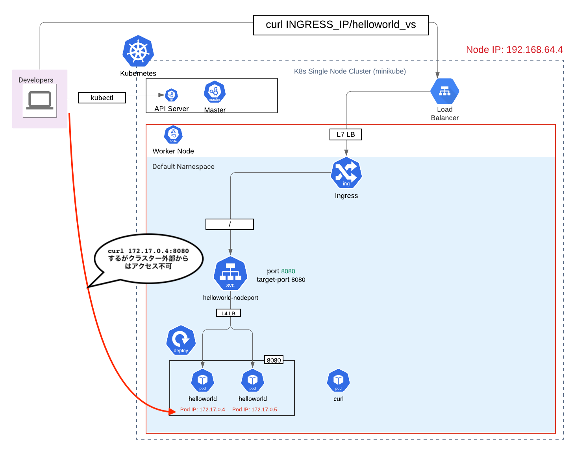
```
kubectl get pods -o=jsonpath='{.items[0].status.podIP}'

curl $(kubectl get pods -o=jsonpath='{.items[0].status.podIP}'):8080
```

## なぜ？？
MinikubeというSingle Node K8sクラスターは、MacOSの場合はVirtualBoxというVMの中に作られています。なので、MacOSのホストネットワークは、VM内にあるK8sクラスターのネットワークとは違うので（外部扱い）、PodのIPにアクセスができないのです。

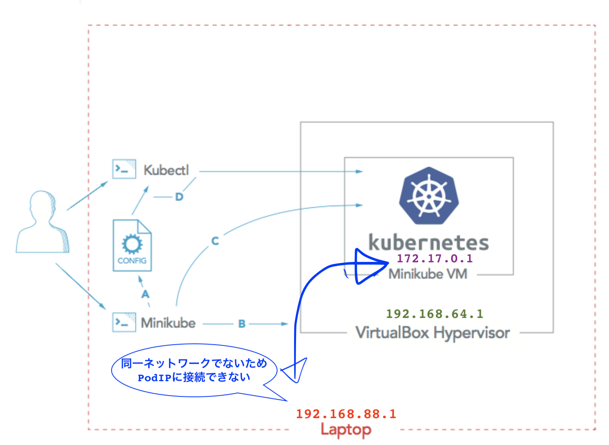

- ホストのIPとVMのネットワークインターフェイスのIPを確認
```
ifconfig
```

Outputを見るとホストの`192.168.88.15`とVMの`192.168.64.1`で、同じCIDRレンジだが、VM内にあるもう1つのK8sのネットワークのIPレンジは`172.17.0.1`なので（別のネットワーク）接続はできない。
```
# ホスト
en0: flags=8863<UP,BROADCAST,SMART,RUNNING,SIMPLEX,MULTICAST> mtu 1500
        ether 78:4f:43:5e:0d:37 
        inet6 fe80::cfa:77a0:efe7:70c7%en0 prefixlen 64 secured scopeid 0x8 
        inet 192.168.88.15 

＃VMのNIC
bridge100: flags=8863<UP,BROADCAST,SMART,RUNNING,SIMPLEX,MULTICAST> mtu 1500
        options=3<RXCSUM,TXCSUM>
        ether 7a:4f:43:e5:e7:64 
        inet 192.168.64.1 netmask 0xffffff00 broadcast 192.168.64.255
```

つまり、Podが外部ネットワークからアクセスできるようにするには、Serviceを作って公開する必要があります。


---
## 4.4 SERVICE: コンテナをService（L4 LB）でクラスタ内部・外部からアクセス可能にする (Expose pod internally/externally using service)

### Service definition & diagram
- ServiceはPodをクラスター内外に公開するL4ロードバランサー
- クラスター内外からPodへの安定的なアクセスを提供できる仮想のIP アドレスを割り当てます
- ref: https://ubiteku.oinker.me/2017/02/21/docker-and-kubernetes-intro/
- serviceはクラスターのメモリ内に存在する

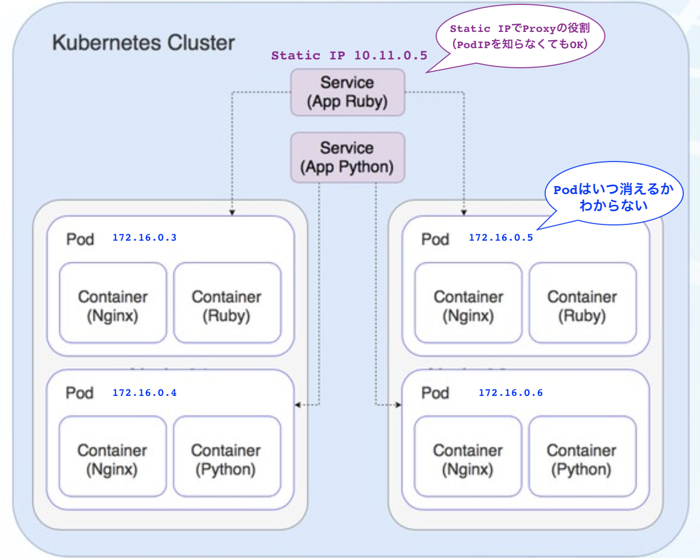

3つのService Type
- ClusterIP (クラスター内)
- NodePort (クラスター内外)
- LoadBalancer (クラスター内外)
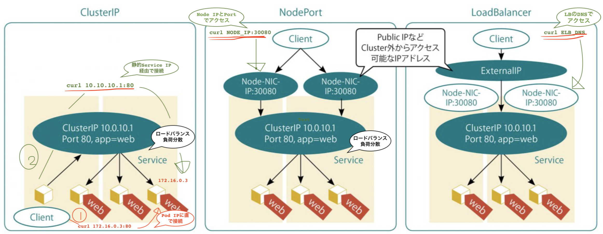

---
## 4.4.1 ClusterIP Service

実際にPodがどのノードに配備されているかは分かりません。仮に分かったとしても、Pod は頻繁に作り直されるので、いつまでも同じPodにアクセスできる保証はありません.

`ClusterIP`のServiceを使う利点は、いつ消えるかわからないPodIPを抽象化し、StaticIPを持ったProxyを前に置くことで：
1. Podにアクセスする際に、Pod IPを知る必要がなくなる 
2. Podにアクセスする際に、ロードバランスしてくれる

ことです。


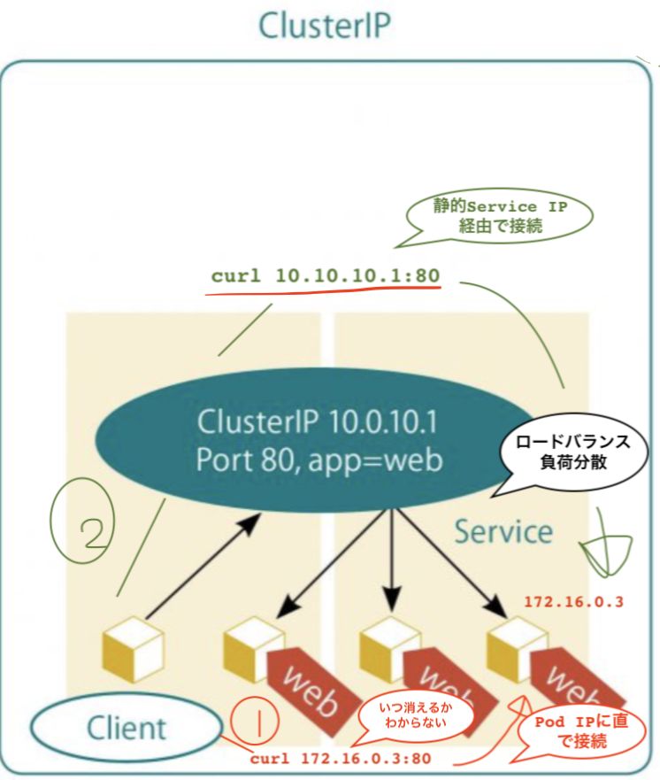

- PodをServiceのClusterIPタイプでクラスター内に公開且つロードバランス
```
kubectl expose pod helloworld --type ClusterIP --port 8080 --name helloworld-clusterip

kubectl get service
service/helloworld-clusterip   ClusterIP   10.98.144.224   <none>
 8080/TCP   7s     run=helloworld
```

- クラスター内の他のPodから、helloworld `ClusterIP` serviceアクセスをテスト
```
kubectl run --restart Never --image curlimages/curl:7.68.0 -it --rm curl sh

# curl helloworld ClusterIP service
curl helloworld-clusterip:8080

Hello, world!
Version: 1.0.0
Hostname: helloworld
```

- もちろんクラスター外のMacからCurlしても接続できない
```
curl 10.98.144.224:8080
curl: (7) Failed to connect to 10.98.144.224 port 8080: Operation timed out
```


---
## 4.4.2 NodePort Service

`NodePort`のServiceを使う利点は、`ClusterIP`では不可能だった、クラスター外へのPodの公開をNodeIPとNodePort経由で可能にすることです。

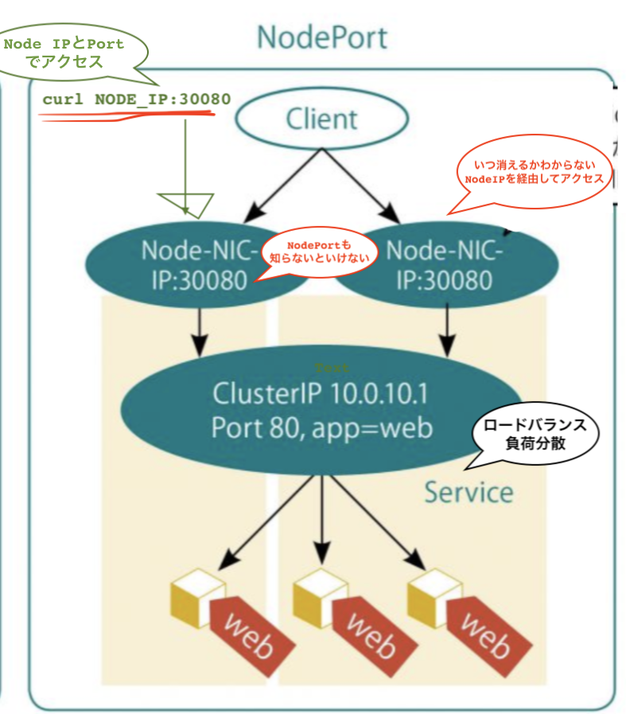

- PodをServiceのNodePortタイプでクラスター外に公開
```
kubectl expose pod helloworld --type NodePort --port 8080 --name helloworld-nodeport

kubectl get service
service/helloworld-nodeport    NodePort    10.101.144.42   <none>
 80:31954/TCP   76s   run=helloworld
```
- クラスター内の他のPodから、helloworld `NodePort` serviceアクセスをテスト
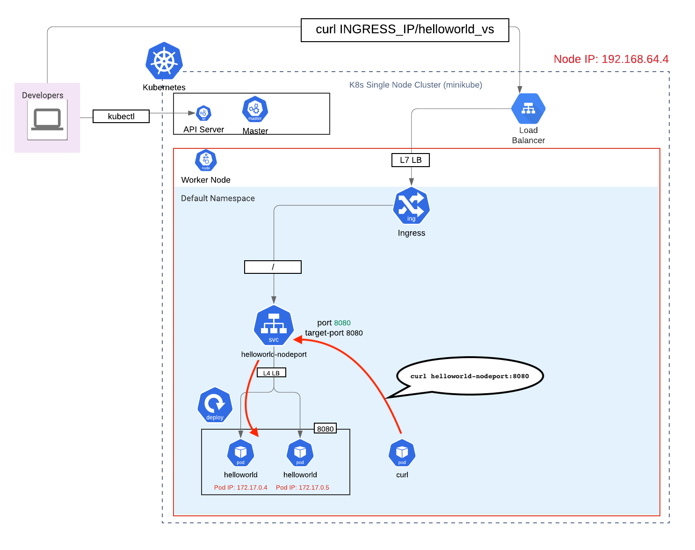

```
# curl helloworld NodePort service
curl helloworld-nodeport:8080

Hello, world!
Version: 1.0.0
Hostname: helloworld
```

- クラスター外のMacから、NodeIPとNodePortを指定してCurlすると接続できる
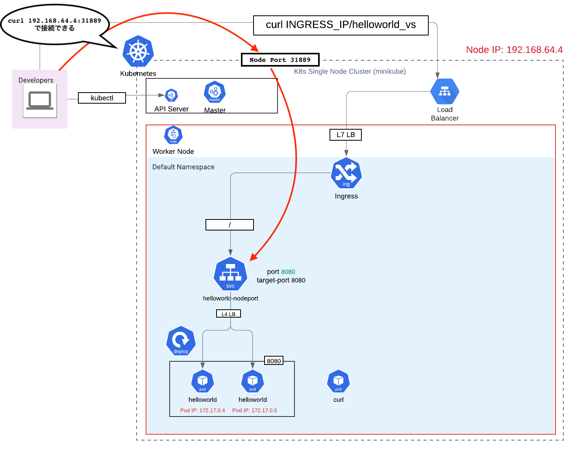
```
# Node IPを取得する
minikube ip
curl 192.168.64.4:31889/

# or

curl $(minikube ip):31889

# or
minikube service helloworld-nodeport --url
```

## しかしNodePortに問題が！

`NodePort`のServiceでクラスター外にPodを公開できますが、問題は
1. NodeIPを知らないといけない
2. Node Port(しかもNodePortは3000以上の数字)を知らないといけない

ことです。

Podが起動・停止してIPが入れ替わるように、Multi-hostクラスター上のNodeも起動・停止してIPが入れ替わるので、NodeIPでPodにアクセスするのは安定的ではありません。

この点を、Podの場合はServiceの`ClusterIP`というProxyにStatic IPを与えることで、PodIPを知る必要がなくなりました。

Nodeも、ロードバランサーをNodesの前に起きStaticIPとDNSを与えることで、NodeIPを知る必要がなくなります。そのためには、Serviceの`LoadBalancer`タイプを使います。


---
## 4.4.3 LoadBalancer Service

クラウドプロバイダのL4ロードバランサーのDNSから, 各ノードの特定のポートにRoutingしてPod にアクセスする。 

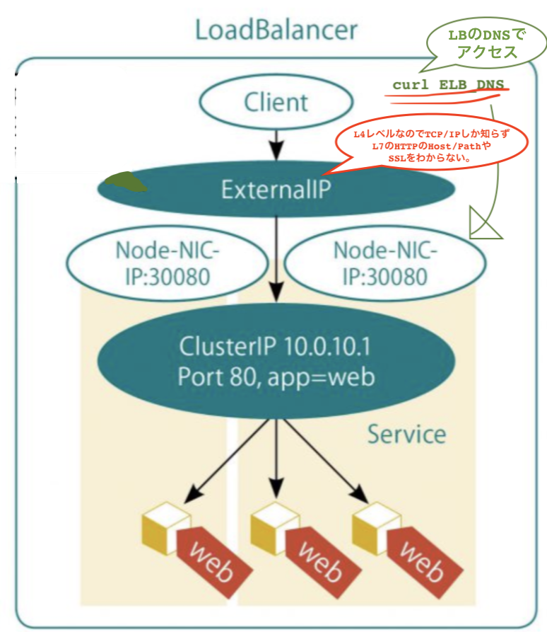

- PodをServiceの`LoadBalancer`タイプでクラスター外に公開
```
kubectl expose pod helloworld --type LoadBalancer --port 8080 --name helloworld-lb

service/helloworld-lb          LoadBalancer   10.104.89.126    <pending>
     8080:31838/TCP   5s     run=helloworld
```
- クラスター内の他のPodから、helloworld `LoadBalancer` serviceアクセスをテスト
```
kubectl run --restart Never --image curlimages/curl:7.68.0 -it --rm curl sh

curl helloworld-lb:8080

Hello, world!
Version: 1.0.0
Hostname: helloworld
```
- クラスター外のMacから、NodeIPとNodePortを指定してCurlすると接続できる
```
minikube service helloworld-lb --url

curl $(minikube service helloworld-lb --url)
```

K8sクラスターをクラウドで運営する場合は、この`LoadBalancer`のServiceは、LBのPublicIPとDNSが与えられます。


## しかしLoadBalancerに問題が！

`LoadBalancer`のServiceでクラスター外にPodを公開し、且つLBのPublicDNSを使ってNodeIPを抽象化しましたが、LoadBalancerの問題は
1. 1つのServiceごとに1つのLBが作られてしまう（高コスト）
2. L4のLBなのでTCI/IPまでしか分かっておらず、L7のHTTPのホスト・パスでのLBの振り分けができない

ことです。

なので、L7レベルのHTTPホスト・パスでLBの振り分けをするためには、`Ingress`を使います。


---
## 4.5 INGRESS: helloworldコンテナをIngress（L7　LB）でクラスタ外部からhost/pathURLでアクセス可能にする (Expose pod internally/externally using service)

### Ingress definition & diagram
- IngressはPodをクラスター内外に公開するL７ロードバランサー
- クラスター外部からURLのホスト・パスによるServiceへの振り分けアクセスができるL7ロードバランシング（負荷分散）
- ref: https://kubernetes.io/docs/tasks/access-application-cluster/ingress-minikube/

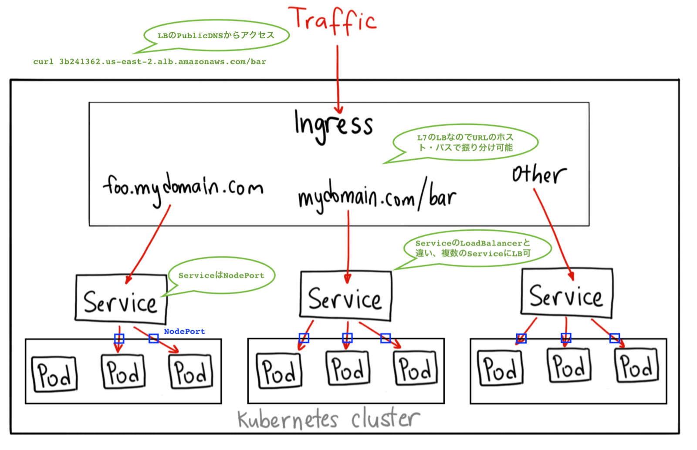

- Ingress addonを追加
```
# Addonをリスアップ
minikube addons list

# Ingress addonを追加
minikube addons enable ingress

# Ingress controller podをチェック
kubectl get pods -n kube-system
```

Ingressを作り、全てのパス`/`を`helloworld-nodeport` serviceに接続します。

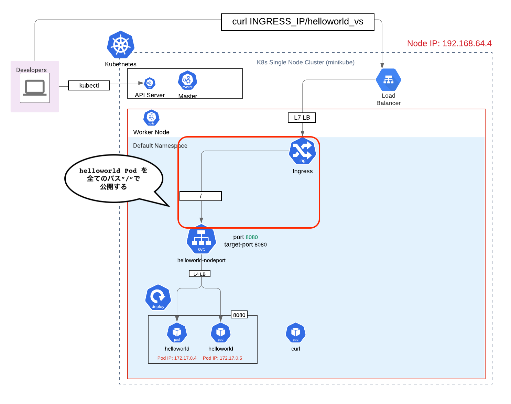

- ingress resourceを作成
```
kubectl apply -f ingress.yaml
```
- ingressをリストアップ
```
kubectl get ingress
```
- ingress resourceの詳細を表示
```
kubectl describe ingress helloworld
```
- ingress controller (ALB)のIPを取得
```
kubectl get ingress | awk '{ print $4 }' | tail -1

# or

kubectl get ingress -o=jsonpath='{.items[0].status.loadBalancer.ingress[0].ip}'
```
- Ingress経由で、helloworld-nodeport　Serviceにアクセス
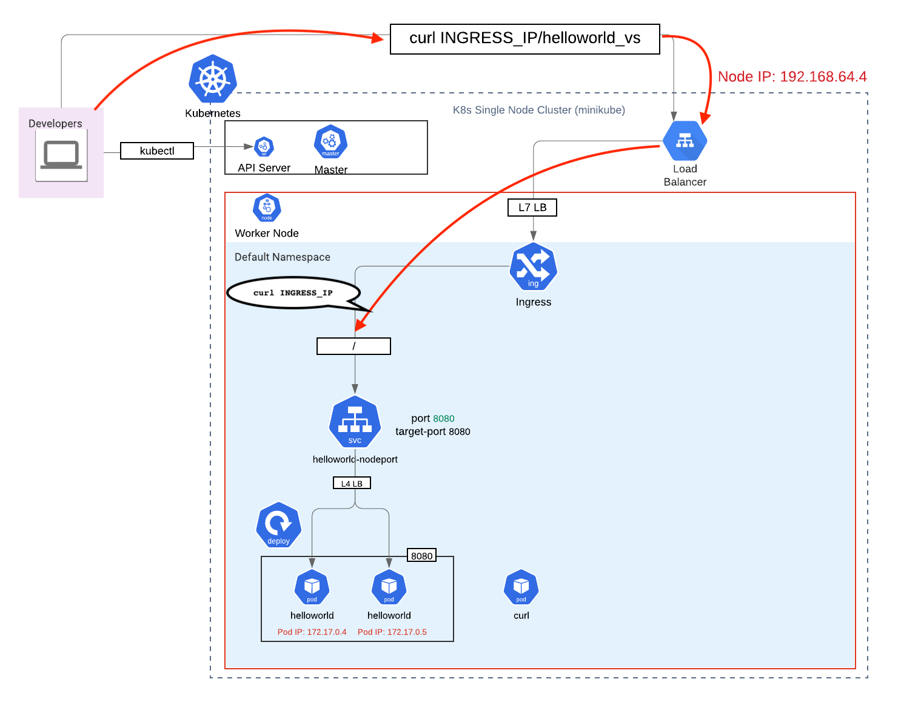

```
curl $(kubectl get ingress | awk '{ print $4 }' | tail -1)
```


### 新しい Ingress リソース /helloworld_v2 の作成
- Hello World v2 Podを作成し、ServiceをNodePortとして公開, HTTPパス`/helloworld_v2`を使ったingress resourceを作成

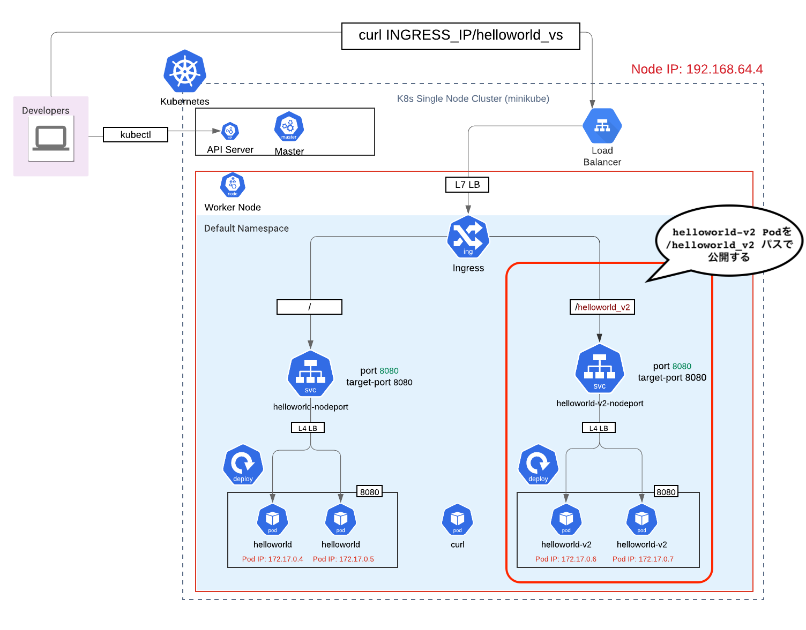

```
# pod
kubectl run --image gcr.io/google-samples/hello-app:2.0 --port 8080 --restart Never helloworld-v2

# service
kubectl expose pod helloworld-v2 --type NodePort --port 8080 --name helloworld-v2-nodeport

# ingress
kubectl apply -f ingress_path.yaml
```
- HTTPパスを使ったingress resourceの詳細を表示
```
kubectl describe ingress helloworld-v2
```

- クラスター内の他のPodから、helloworld-v2 Podアクセスをテスト
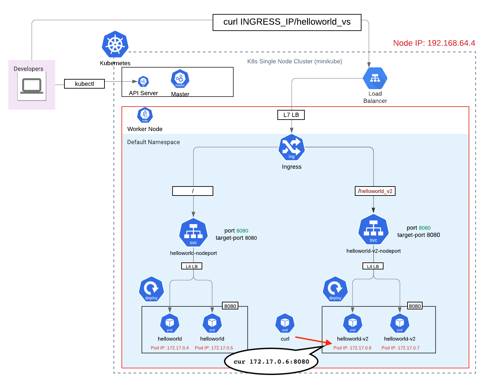
```
kubectl run --restart Never --image curlimages/curl:7.68.0 -it --rm curl sh

# curl helloworld-v2 pod
curl 172.17.0.6:8080

Hello, world!
Version: 2.0.0
Hostname: helloworld-v2
```


- クラスター内の他のPodから、helloworld-v2-nodeport serviceアクセスをテスト 
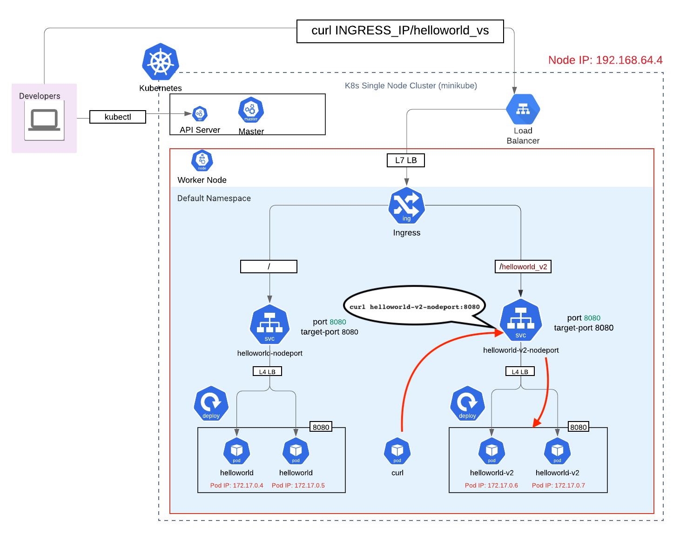
```
curl helloworld-v2-nodeport:8080

Hello, world!
Version: 2.0.0
Hostname: helloworld-v2
```


- Ingressの`/helloworld_v2`パス経由で、helloworld-v2-nodeport　Serviceに アクセス
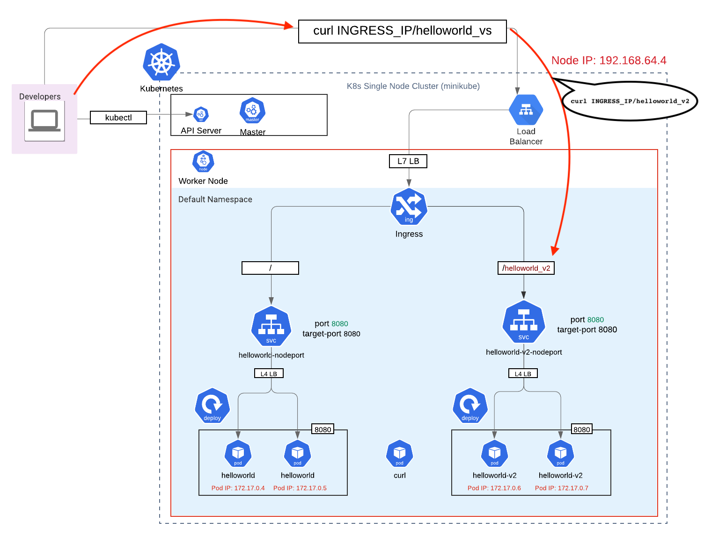

```
curl $(kubectl get ingress helloworld-v2 | awk '{ print $4 }' | tail -1)/helloworld_v2

Hello, world!
Version: 2.0.0
Hostname: helloworld-v2
```

### Cleanup
```
kubectl delete pod helloworld
kubectl delete pod helloworld-v2
```

---
## 4.6 REPLICA: helloworldコンテナをスケールアップ (scale up pods using deployment)

### Replicas definition & diagram
- ReplicaはPodを複製する
- Self-healingは死んでも死んでも生まれ変わって出てくるスミス
- Specで定義されたレプリカの数を自動配置・維持(配備と冗長化)
- Podの数はDynamicに定義もできます（水平Auotoscaling）

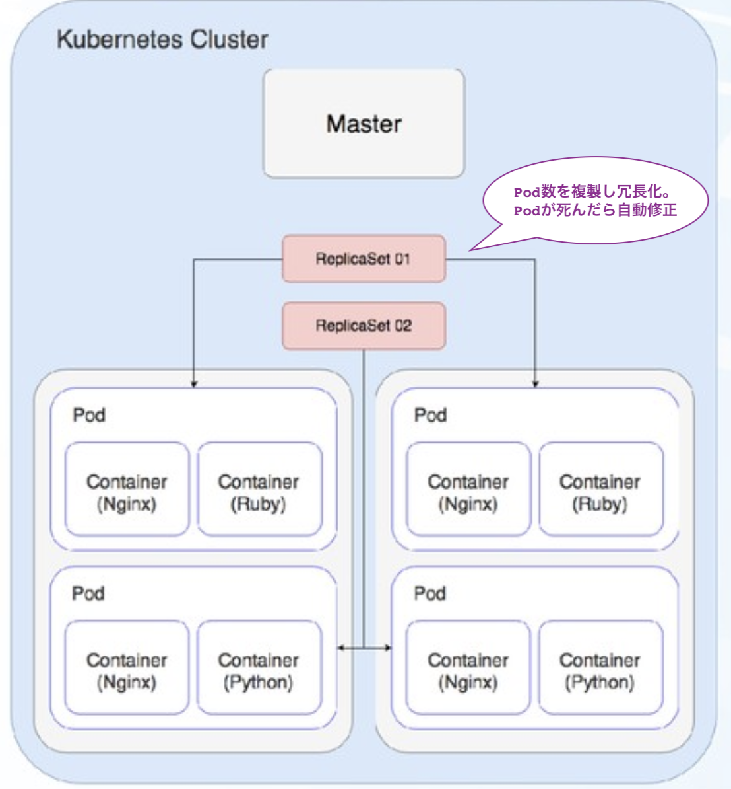

- scale --replicas=3
```
#まずはPodをReplicasetとして1つ起動
kubectl apply -f replicaset.yaml

＃Replicasetをリストアップ
kubectl get replicaset

＃3つにスケールアップ
kubectl scale --replicas=5 replicaset/helloworld　
```

- 1つのPodを停止してみる
```
kubectl delete pod POD_ID
```

- 新しいPodが自動生成されたのがわかる
```
kubectl get pods

# cleanup
kubectl delete -f replicaset.yaml
```

---
## 4.7 DEPLOYMENT: helloworldコンテナをローリングアップデート、ロールバック (rolling update & rollback pods using deployment)

### Deployment definition & diagram
- Deploymentは、Deploy時に新しいreplica Setを作成し旧ReplicaSet管理下の旧Podを1つづつ減らしながら、新ReplicaSet下の新Podを増やし、段階的に置き換えていく。またロールバックも可能 
- ref: https://ubiteku.oinker.me/2017/02/21/docker-and-kubernetes-intro/
- Deployment – replica Set の配備・更新ポリシーを定義するのが Deployment 

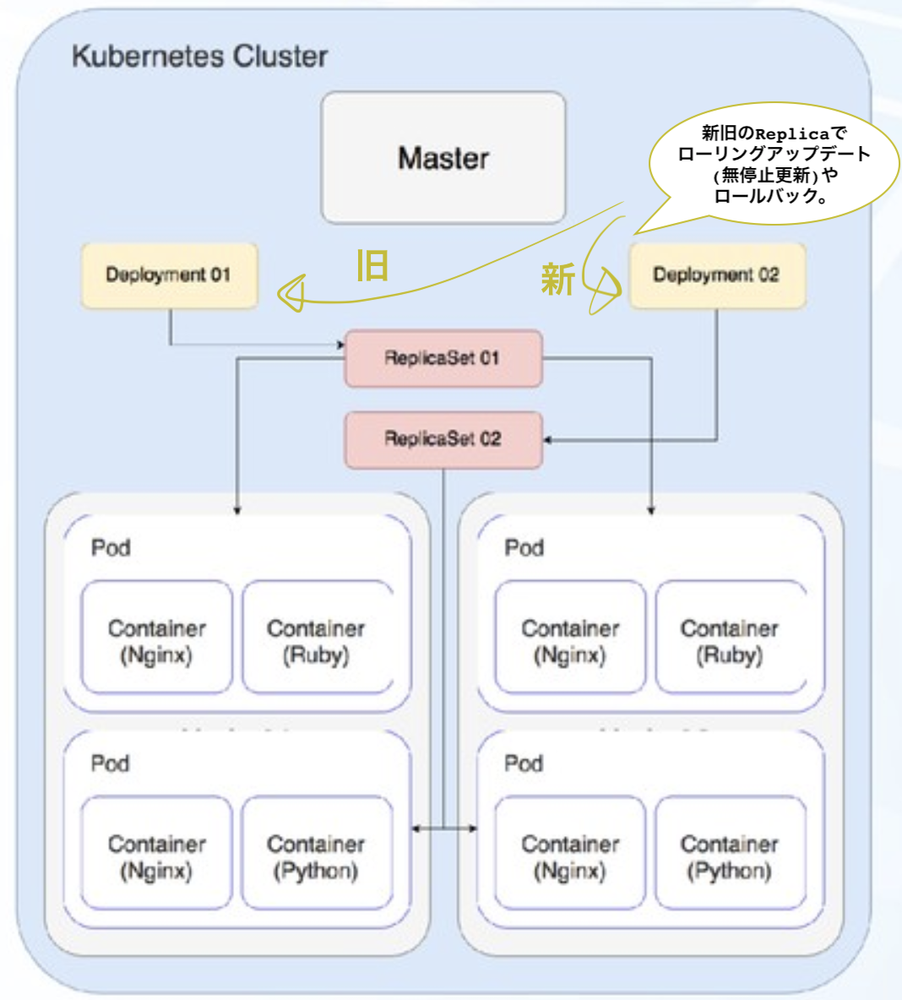

```
#まずはPodをDeploymentとして1つ起動
kubectl run --image gcr.io/google-samples/hello-app:1.0 helloworld 

＃Deploymentをリストアップ
kubectl get deployment

＃3つにスケールアップ
kubectl scale --replicas=5 deploy/helloworld
```
- クラスター外のMacから、Deploymentで配置されたPodにCurlすると接続できる
```
curl $(minikube service helloworld-nodeport --url)
```
- Deploymentをローリングアップデート
```
kubectl set image deploy/helloworld helloworld=gcr.io/google-samples/hello-app:2.0

# RollingUpdate中のHelloworldPodをCurlすると、v1とv2の両方からResponseが返ってくる
for i in {1..30}; do curl $(minikube service helloworld-nodeport --url); done

＃履歴チェック
kubectl rollout history deploy/helloworld

# ロールバック
kubectl rollout undo deploy/helloworld  
```
- クリーンアップ
```
kubectl delete deploy helloworld
kubectl delete svc helloworld-clusterip
kubectl delete svc helloworld-nodeport
kubectl delete svc helloworld-lb
kubectl delete svc helloworld-v2-nodeport
kubectl delete -f ingress.yaml 
kubectl delete -f ingress_path.yaml 
```


---
NEXT > [5_K8s_Manifest_File](../5_K8s_Manifest_File/README.md)